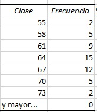
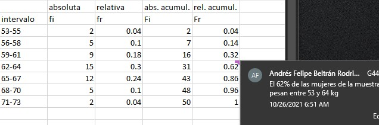
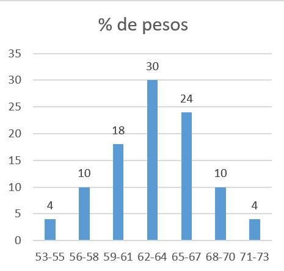
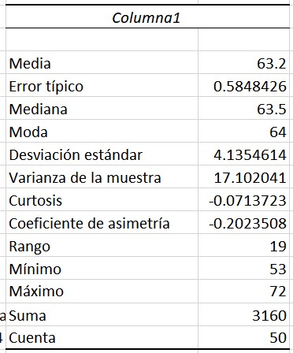
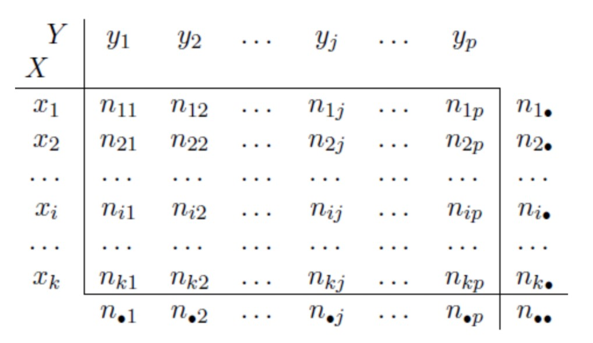
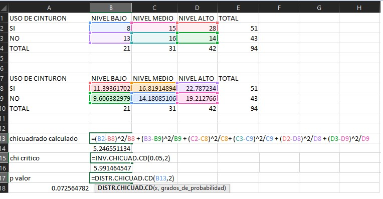
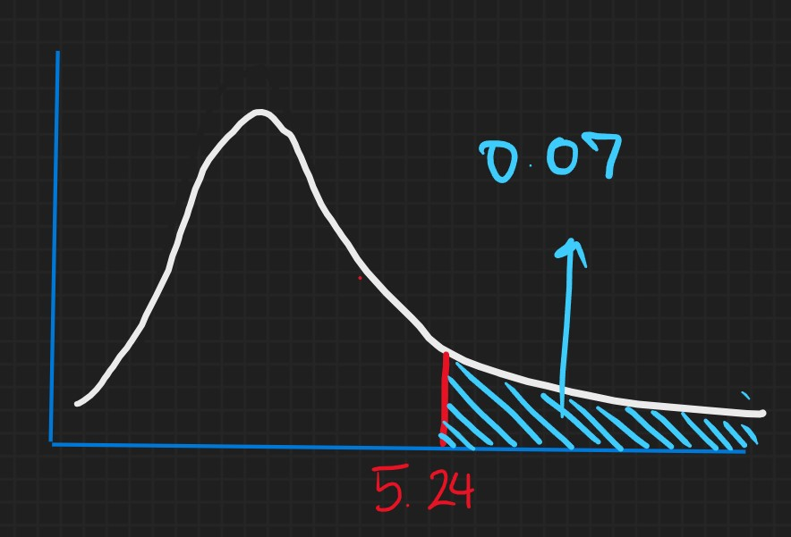
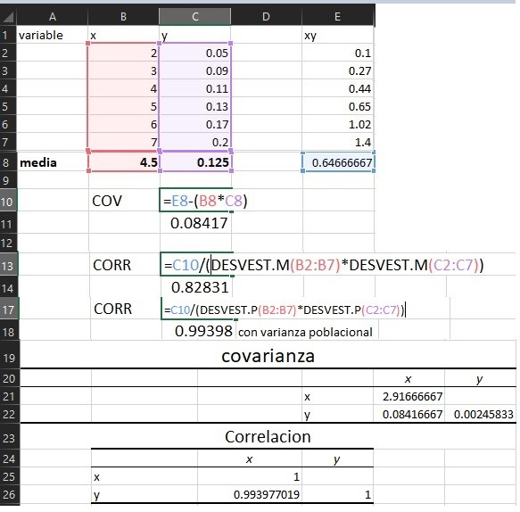

# Conceptos básicos de estadística


# Población (universo o colectivo)

Es el conjunto total de ELEMENTOS de la misma naturaleza cualquera que sea, que son de interés para un problema dado

* N = Representación de el tamaño de la población

# muestra


## Variable aleatoria:

Son fenómenos o características de los elementos de la población.

Función de valor real que tiene como dominio el espacio muestral de un experimento aleatorio.

Variables sobre las cuales tenemos un grado de icertidumbre respecto a los valores que puede tomar

## Datos

Son los resultados observados de las variables aleatorias (Cuando se hace una medición)

## Parámetro

Es la medición global de cualesquer característica de los elementos de la población.

Es un valor teórico asociado a la población.

### Ejemplos 

#### Población: Los niños y niñas de 0 a 5 años de edad localozados en Bogotá

#### Variables: género, edad, peso, talla, estrato, localidad, fecha, lugar de nacimiento..

#### Parámetros: IMC

<!--  -->

# Clasificacion de variables

## Cualitativas (categóricas)


## Cuantitativas

Los valores de las observacione so niméricas y en conseciencia, ordenables.

### Discreta
Recorridos finitos numerables sin tomar valores intermedios e.g. conteos.

### Continua
Recorridos infinitos no numerables e.g. la distribución normal

# Escalas de medición 

## Cualitativas

### Nominales: Clasificación de objetos o fenómenos mediante símbolos o signos (No hay orden o dirección). e.g. 

* Nombre
* Número de la cédula
* Tipo de sangre
* Color de los ojos
* Número de camiseta de los jugadores

Los números en la lista anterior no pueden ser sometidos a operaciones matemáticas

### Ordinales

Categorías ordenadas (Rangos, órdenes, escalamientos)

* Sabor de un yogurt

## Cuantitativas

### Intervalo
Los datos medidos en una escala orrdinal para los cuales pueden clasificarse las distancias entre valores pero no existe un cero absoluto o no exista ausencia total de la característica

* Temperatura: a 0°C no deja de existir la temperatura
* Notas: se corre la escala e inicia desde 3.

### Razón

Tiene todas las características de un intervalo, y además tiene un cero absoluto 

<!--  -->

# Resumen y descripción de datos de una variable

Datos en bruto en forma de listas (o bases no son fáciles de usar para tomar decisiones)

* Se necesita algún tipo de organización

Para esto podemos utilizar gráficos de barras, graficos de torta, o tablas de frecuencias.

# Como agrupar los datos: Sturgues


Si n no es demasiado grande, intervalos = $\sqrt{n}$ 

En caso contrario:

\begin{align}
k = 1 + 3.322 log(n)
\end{align}

k = intervalos de clase

Para la longitud de los intervalos:

\begin{align}
L = \frac{Dato \; mayor - Dato \; menor}{n}
\end{align}

* A menudo es prueba y error

<!--  -->

# Tipos de frecuencias

* Absoluta: Conteo de observaciones que cae en cada intervalo.
* Relativa: $\frac{Absoluta}{n}$.
* Acumulada: Suma de las frecuencias absolutas
* Relativa acumulada: Suma de las frecuencias relativas.

# Caracteristicas a revisar de las distribuciones

* Distribucion
* Localizacion (sesgo)
* Dispersion

# Medidas de localización

## Media aritmética:

Si $x_1, x_2, x_3,...x_n$ es una muestra de una poblacion de tamaño N entonces la media es N

### Media poblacional
\begin{align}
\mu = \frac{\sum_{i=1}^n x_i}{N}
\end{align}


### Estimador muestral
\begin{align}
\bar{x} = \frac{\sum_{i=1}^n x_i}{n}
\end{align}

Caracteristicas:

* Es facil de obtener
* Medida no robusta: Afectada por valores extremos o datos atípicos.

### Propiedades de la media aritmetica:

Si $x_1, x_2, x_3,...x_n$ es una muestra de una poblacion de tamaño N entonces la media es N, entonces

\begin{align}
\sum_{i=1}^n x_i = x_1 + x_2 + x_3 + \cdot \cdot \cdot + x_n
\end{align}

Si $x_i = c$ y a su vez c es constante, 
entonces 

\begin{align}
\sum_{i=1}^ n x_i = \sum_{i=1} c = c + c + c +  \cdot \cdot \cdot 
\end{align}
 

Entonces

\begin{align}
\sum_{i=1}^n x_i = nc
\end{align}


* *Ejemplo:*
 
\begin{align}
\sum_{i=1}^5 2 = 2 + 2 + 2 + 2 + 2
\end{align}

 
Si c es una constante que multiplica las observaciones:  

\begin{align}
\sum_{i=1}^n c x_i = c \sum_{i=1}^n x_i
\end{align}

\begin{align}
\sum_{i=1}^n c x_i = c \cdot x_1 + c \cdot x_2 + c \cdot x_3 + \cdot \cdot \cdot + c \cdot x_n
\end{align}

\begin{align}
\sum_{i=1}^n c x_i = c \; (x_1 +   x_2 +  x_3 + \cdot \cdot \cdot +   x_n)
\end{align}

\begin{align}
\sum_{i=1}^n c x_i = c \sum_{i=1}^n x_i
\end{align}


Si $x_1, x_2, x_3,...x_n$ y $y_1, y_2, y_3,...y_n$ son sucesiones de numeros;

\begin{align}
\sum_{i=1}^n (x_i + y_i) =  \sum_{i=1}^n x_i + \sum_{i=1}^n y_i
\end{align}


\begin{align}
\sum_{i=1}^n (x_i + y_i) =  (x_1 + y_1) 
+ (x_2 + y_2) + (x_3 + y_3) + \cdot \cdot \cdot + (x_n + y_n)
\end{align}

\begin{align}
\sum_{i=1}^n (x_i + y_i) =  (x_1 + x_2 + \cdot \cdot \cdot + x_n ) + (y_1 + y_2 + \cdot \cdot \cdot + y_n )
\end{align}

\begin{align}
\sum_{i=1}^n (x_i + y_i) =  \sum_{i=1}^n x_i + \sum_{i=1}^n y_i
\end{align}

Si $x_1, x_2, x_3,...x_n$ y $y_1, y_2, y_3,...y_n$ son sucesiones de numeros;

\begin{align}
\sum_{i=1}^n (x_i - y_i) =  \sum_{i=1}^n x_i - \sum_{i=1}^n y_i
\end{align}


5. 

\begin{align}
\sum_{i=1}^n (x_i - \bar{x}) = 0
\end{align}

\begin{align}
\sum_{i=1}^n (x_i - \bar{x}) =  \sum_{i=1}^n x_i - \sum_{i=1}^n \bar{x}
\end{align}
 
\begin{align}
 \sum_{i=1}^n (x_i - \bar{x}) = \frac{n}{n} \sum_{i=1}^n x_i - n \bar{x}
\end{align}

\begin{align}
 \sum_{i=1}^n (x_i - \bar{x}) = n \bar{x} - n \bar{x}
\end{align}

\begin{align}
 \sum_{i=1}^n (x_i - \bar{x}) = 0
\end{align}

6.

promedio de y en funcion de promedio de x en regresion lineal simple

Si $y_i = a + b x_i$ siendo a y b constante

\begin{align}
\bar{y} = a + b \bar{x}
\end{align}

En efecto:

\begin{align}
\sum_{i= 1}^n y_i = \sum_{i=1}^n (a + b x_i)
\end{align}

\begin{align}
\sum_{i= 1}^n y_i = \sum_{i=1}^n a + \sum_{i=1}^n b x_i
\end{align}

\begin{align}
\sum_{i= 1}^n y_i = na + b \sum_{i=1}^n  x_i
\end{align}

\begin{align}
\frac{\sum_{i= 1}^n y_i}{n} = \frac{na}{n} +b \frac{ \sum_{i=1}^n  x_i}{n}
\end{align}

\begin{align}
\bar{y} = a + b \bar{x} 
\end{align}

## La mediana

Es el valor central (es el dato de la variable que esta en el centro de la misma). Deja por encima y por debajo mitad y mitad de las observaciones.

### Calculo de la mediana

Depende si el conjunto es par o impar:

 Si$x_1, x_2, x_3,...x_n$ Son los valores ordenados en una muestra de una poblacion de tamaño N:
 
 
$\hat{x} = \frac{x_{n/2}+x_{n+1/2} }{2}$ si n es par

$\hat{x} = x_{n=1/2}$ si n es impar

Es un estimador robusto, no se ve afectado por valores extremos

### Ejemplo

Edad de ninos
```{r}
x1 <- c(6,7,8,9,10)
```

n es impar, entonces $\hat{x} = x_{n+1/2}=x_{6/2} = x_3 = 8$

De la muestra analizada la mitad de los ninos tienen entre 6 y 8 años, y la otra mitad entre 8 y 10 años.

# Moda

* El valor que más se repite 
* Usada para valores numéricos o categóricos

e.g. Cual es el color más frecuente en los ojos.

# Medidas de dispersión o variación

## Varianza 

Uno de los problemas es que la unidad de medida queda al cuadrado, e.g. si se miden cm, la varianza tiene unidades de $cm^2$:

* Varianza poblacional:

\begin{align}
\sigma^2= \frac{\sum_{i=1}^N (x_i - \mu)^2}{N}
\end{align}

* Varianza muestral:

\begin{align}
s^2= \frac{\sum_{i=1}^n (x_i - \bar{x})^2}{n-1}
\end{align}

\begin{align}
s^2 = \sum_{i=1}^n \frac{x_i^2 - 2x_i\bar{x}+ \bar{x}^2}{n-1}
\end{align}

\begin{align}
s^2 =  \frac{\sum_{i=1}^n x_i^2 - 2\bar{x}\sum_{i=1}^n x_i+ n\bar{x}^2}{n-1}
\end{align}

\begin{align}
s^2 =  \frac{\sum_{i=1}^n x_i^2 - 2\bar{x} \frac{n}{n}\sum_{i=1}^n x_i + n\bar{x}^2}{n-1}
\end{align}

\begin{align}
s^2 =  \frac{\sum_{i=1}^n x_i^2 - 2\bar{x} n \bar{x} + n\bar{x}^2}{n-1}
\end{align}

\begin{align}
s^2 =  \frac{\sum_{i=1}^n x_i^2 - 2 n \bar{x}^2 + n\bar{x}^2}{n-1}
\end{align}

\begin{align}
s^2 =  \frac{\sum_{i=1}^n x_i^2 - n \bar{x}^2 }{n-1}
\end{align}

\begin{align}
s^2 =  \frac{\sum_{i=1}^n x_i^2}{n-1} -\frac{ n \bar{x}^2 }{n-1}
\end{align}

\begin{align}
s^2 =  \frac{\sum_{i=1}^n x_i^2}{n-1} -\frac{ n }{n-1}
\left( \frac{\sum_{i=1}^n x_i}{n} \right)^2
\end{align} 

\begin{align}
s^2 =  \frac{\sum_{i=1}^n x_i^2}{n-1} -\frac{ 1 }{n-1}
 \frac{\left(\sum_{i=1}^n x_i\right)^2}{n} 
\end{align} 

En algunos casos puede ser más conveniente calcular la varianza de esta forma.


## Coeficiente de variación

$CV = \frac{s}{\hat{x}} \cdot 100 \%$

Si CV es igual o menor a $5 \%$ hay homogeneidad

si esta entre $5\%$ y $20\%$ los datos son medianamente homogeneos

Si CV mayor a 20% hay heterogeneidad                                                         
## Rango

medida no robusta, si hay datos atipicos se ve muy afectado

## rango intercuartilico

boxplot

# Cuartiles


Se divide en cuatro partes porcentiales el conjunto de observaciones.

Se calcula de la sigueinte manera.

Se ordena la muestra y se toma la posicion que corresponde.

$Q_k = k \cdot \frac{n}{4} \; k =1,2,3$


## Deciles

Se divide en diez partes porcertialmente iguales


$D_k = \frac{n}{10} \; 1,2,3,...,9$


## Percentiles

es mas detallado, nos da mas acceso a distintos puntos de la distribucion

$P_k = \frac{n}{100} \; 1,2,3,...,99$


# Coeficientes de asimetría de Fisher

Permite interpretar la forma de la distribución, respecto a ser o no asimétrica


# Coeficiente de curtosis

Mide el grado de aplastamiento o apuntamiento de la gráfica de la distribución.

# Otras medidas de centralización

<!--  -->

## Desviacion media absoluta

\begin{align}
DM = \frac{\sum_{i = 1}^n |x_i - \bar{x}|}{n}
\end{align}

## Media ponderada
## Media geometrica
## Media armonica
Sirve en diseño de experimentos par aproximar el numero de replicas en todo el expermineto cuando el diseño es desbalanceado.


# Ejemplo en excel

 Tabla de pesos de mujeres en una empresa
 
1. construcción de la tabla de frecuencias

* Definición de los intervalos: podemos utilizar la siguiente ecuación:

\begin{align}
k = 1 + 3.322 log_{10} (n)
\end{align}

Para esta muestra de 50 pesos de mujeres:

\begin{align}
k = 1 + 3.322 log_{10} (50)
\end{align}

\begin{align}
k = 6.6 \approx 7
\end{align}

Vamos a usar 7 intervalos, para saber la longitud dividimos el rango en el numero de intervalos.

Para hallar el rango podemos importar los datos a R:

```{r importando la tabla de pesos}

tablaPesos <- read.table("TABLAPESOS.txt", header = T)

```

Y luego preguntar sobre el valor maximo y el minimo:

```{r}
max(tablaPesos)
min(tablaPesos)
```
Podemos entonces calcular la longitud de cada intervalo:

```{r}
(max(tablaPesos)-min(tablaPesos))/7
```
Obtenemos una longitud de intervalo de $2.71 \approx 3$

Los intervalos entonces serían:

```{r, echo = F}
intervalosPesos <- data.frame(intervalo=as.character(c(1:7)),
                             valores = c('53 55',
                                         '56 58',
                                         '59 61',
                                         '62 64',
                                         '65 67',
                                         '68 70',
                                         '71 73'))
intervalosPesos
```

En excel:

* Usamos los limites superiores de los intervalos
    + Datos, analisis de datos, histograma, aceptar, seleccionar rango de entrada, rango de clases son los limites superiores.
      Al hacer esto, excel genera una tabla como la siguiente:



Luego, a partir de esta tabla podemos calcular todas las frecuencias, la frecuencia absoluta ($f_i$), recuencia relativa ($f_r$), la frecuencia absoluta acumulada ($F_i$) y la frecuencia relativa acumulada ($F_r$):


Luego a partir de esta tabla de frecuencias, utilizando las columnas de intervalo y % de frecuencia podemos construir un histograma como el siguiente:


Para hacer una operación análoga en R podemos crear los intervalos de la siguiente manera:

```{r}
mins <- seq(53,71, by = 3)
maxs <- seq(55,73, by = 3)
```

Luego, podemos juntar las dos columnas de limites inferiores y superiores de intervalo en la tabla `TDF`:

```{r}
TDF <- data.frame(min = mins,
                                 max = maxs )
TDF
```

Luego podemos iterar a lo largo de las filas de `tablasDefrecuencias` buscando cuantos elementos de `tablaDePesos` están dentro del intervalo definido por cada fila:

```{r}
for(i in 1:nrow(TDF)) {
  TDF$Freq[i] <-
      length(
          which(
mins[i] <=  tablaPesos & tablaPesos<= maxs[i]))
}
```

Podemos luego calcular la frecuencia relativa dividiendo por el total de observaciones:

```{r}
TDF$fr <-TDF$Freq/
    sum(TDF$Freq)

TDF
```


Luego podemos calcular la frecuencia absoluta y relativa acumuladas para cada intervalo de manera ascendiente:

```{r}
for(i in 1:nrow(TDF)){

TDF$Fi[i] <- sum(TDF$Freq[1:i])

}
```

Podemos hacer lo mismo para la frecuencia relativa acumulada ($F_r$):

```{r}
for(i in 1:nrow(TDF)){

TDF$Fr[i] <- sum(TDF$fr[1:i])

}
```

Una vez tenemos la tabla de frecuencias completa, podemos hacer la gráfica de frecuencias porcentuales:

```{r}
library(ggplot2)
intervalos <- factor(paste(TDF$min,'-',TDF$max))

ggplot(TDF,
       aes(x = intervalos,
           y = fr*100,
           fill=intervalos,
           label = round(fr*100,2)
           )
       ) +
    geom_bar(stat="identity") +
  xlab("intervalo") +
    ylab('% frecuencia relativa')+
  geom_label(aes(fill = intervalos),
             colour = "white",
             fontface = "italic")
```

# Calculo de medidas descriptivas

```{r}
mean(tablaPesos$pesos)
quantile(tablaPesos$pesos)

```
El 75% de las mujeres pesan entre 53 y 66 kg. El 25% restante pesa entre 66 kg y 72 kg

* la varianza: Es importante calcular la varianza muestral y no la varianza poblacional, dado que no se puede saber la poblacional ($\sigma^2$) si no su estimador ($s^2$).

* Algunos paquetes hacen calculos con la varianza poblacional

En R: 'The denominator n - 1 is used which gives an unbiased estimator of the (co)variance for i.i.d. observations. '

```{r}
var(tablaPesos$pesos)
```
Para calcular la varianza poblacional:

```{r}
pesos <- tablaPesos$pesos
sum((pesos - mean(pesos))^2)/length(pesos)
```
para el calculo de la desviacion estandar:

```{r}
sd(pesos)
sqrt(var(pesos))
```
Interpretación:

Varianza: Tiene unidades al cuadrado.
Tendriamos que tener otro grupo de comparación, con una medición similar.

Desviacion estandar: la desviacion de las observaciones respecto al promedio es de 4.14 unidades de masa (kg).

Para calcular otros estadísticos descriptivos podemos utilizar en excel:

* Datos > Análisis de datos > Estadística descriptiva > Se selecciona rango de entrada y de salida.

Se obtiene la siguiente tabla:



Dentro de esta tabla está el error típico

## Error típico - error estándar

\begin{align}
\frac{s}{\sqrt(n)}
\end{align}

En este caso:

```{r}
sd(pesos)/sqrt(50)
```
Se utiliza para inferencia, para intervalos de confianza. En diseño de experimentos sirve para el cálculo de tamaño de muestra. Se espera que no aumente el número de réplicas si no disminuye lo suficiente el error típico.

```{r}
library(e1071)
kurtosis(pesos)
skewness(pesos)
```
La distribucion de pesos tiene una curtosis $<3$, lo cual indica que es mas aplanada que una distribucion normal, o tiene hombros más pesados.

Además, tiene un coeficiende de asimetría cercano a cero, lo cual indica un ligero sesgo con cola hacia valores menores de peso.

```{r}
range(pesos)
range(pesos)[2] - range(pesos)[1]
```
La persona que mas peso tiene, tiene 19 kg mas que la persona de menos peso.

Tambien podemos graficar la frecuencia acumulada:


```{r}
library(ggplot2)
intervalos <- factor(paste(TDF$min,'-',TDF$max))

ggplot(TDF,
       aes(x = intervalos,
           y = Fr*100,
           fill=intervalos,
           label = round(Fr*100,2)
           )
       ) +
    geom_bar(stat="identity") +
  xlab("intervalo") +
    ylab('% frecuencia relativa')+
  geom_label(aes(fill = intervalos),
             colour = "white",
             fontface = "italic")
```

el 86% de las mujeres pesan entre 53 y 67 kg.

## Desviación media absoluta


## Ejemplo de edades

Este ejemplo está en el código llamado `medidasdescriptivas.R`

Aun asi podemos 

# Proporción

Es similar al promedio, para variables de tipo cualitativo:

$$
\begin{array}{c}
  \hat{p} = \frac{\sum_{i=1}^n x_i}{n}
\end{array}
$$
Con esta ecuación es posible calcular las proporciones.

$$
\begin{array}{c}
x_i =
   \begin{cases}
      1 & \text{Si cumple la condicion}\\
      0 & \text{Si no}
    \end{cases}
\end{array}
$$

Para calcular la proporcion de varias variables cualitativas podemos utilizar la funcion `crosstable` del paquete `gmodels`.

Tambien se puede buscar asociacion entre las variables. Existen pruebas de asociación tales como la de $ji$ cuadrado.

# Asociacion

*'La existencia de asociación entre dos variables indicaría que la distribución de los valores de una de las dos variables difiere en función de los valores de la otra'*

La asociación entre 2 variables de diferente tipo se puede encontrar:

* El caso de dos variables categoricas
# Prueba de independencia chi cuadrado

La prueba de independencia de chi cuadrado de termina si hay alguna asociacion entre variables categóricas (Si están asociadas o son independientes) Es una prueba no paramétrica.

Esta prueba utiliza una tabla de contingencia para analizar los datos. Ésta tabla es un arreglo en el cual los datos son clasificados de acuerdo a dos variables categóricas. Las categorías de una variable aparecen en las filas, y las categorías para la otra variable a aparecen en las columnas. Cada variable debe tener dos o más categorías o niveles. Cada celda refleja el conteo total de casos para un par especifico de categorías.


:::: {.center data-latex=""}

::: {.minipage data-latex="{.8\linewidth}"}
**NOTA**

Existen varias pruebas con el nombre 'prueba chi-cuadrado' además de la prueba de independencia de chi cuadrado. Es útil revisar el contexto de los datos y la pregunta de investigación para asegurar cual forma de la prueba chi cuadrado se está utilizando.
:::

::::

## Usos de la prueba

la prueba de independencia de chi cuadrado se utiliza comúnmente para probar:

* Independencia estadística o asociación entre dos o más variables categóricas.

La prueba de independencia chi-cuadrado solo muede comparar variables categóricas. No puede hacer comparaciones entre varaibles continuas o entre variables continuas y categoricas. Además, La prueba de independencia chi-cuadrado solo *evalua asociaciones* entre variables categoricas, y no puede inferir nada sobre causalidad.

## requerimientos de los datos

Los datos deben cumplir las siguientes condiciones:

1. Tener dos variables categóricas.
2. Dos o más categorías (grupos) o niveles para cada variable.
3. Independencia de las observaciones.
    * No existen relaciones entre los sujetos de cada grupo
    * Las variables categoricas no estan 'emparejadas' de   manera.
4. Tamaño de muestra relativamente grande.
    * Se espera por lo menos una frecuencia de 1 en cada celda.
    * Se esperan frecuencias de por lo menos 5 en la mayoria (80%) de celdas.
    
## Hipotesis

La hipótesis nula $(H_0)$ y la hipótesis alternativa $(H_1)$ de la prueba de independencia de la prueba de chi cuadrado pueden ser expresadas de dos maneras diferentes pero equivalentes:


:::: {.center data-latex=""}

::: {.minipage data-latex="{.9\linewidth}"}

$$
\begin{array}{c}
H_0 : \text{La [variable 1] es independiente de la [variable 2]}
\end{array} \\
$$
$$
\begin{array}{c}
H_1 : \text{La [variable 1] no es independiente de la [variable 2]}
\end{array}
$$
O 
$$
\begin{array}{c}
H_0 : \text{La [variable 1] No está asociada con  [variable 2]}
\end{array} \\
$$
$$
\begin{array}{c}
H_1 : \text{La [variable 1] está asociada con [variable 2]}
\end{array}
$$
:::

::::

## Tabla de contingencia

para i = 1, ..; , k y j = 1, ..., p se tiene que $n_{ij}$ es el número de individuos o **frecuencia absoluta** que presentan a la vez las modalidades $X_i$ e $Y_i$

El numero de individuos que presentan la modalida $x_i$, es lo que llamamos *frecuencia absoluta marginal* de $x_i$ y se representa como:

$$
\begin{array}{c}
n_{i\bullet} = n_{i1} + n_{i2} + \cdot \cdot \cdot + n_{ip} = \sum_{j=1}^p n_{ij}
\end{array}
$$

De forma análoga se define la frecuencia absoluta marginal de la modalidad $y_j$ como:
$$
\begin{array}{c}
n_{\bullet j} = n_{1j} + n_{2j} + \cdot \cdot \cdot + n_{kj} = \sum_{i=1}^k n_{ij}
\end{array}
$$
El número total de elementos de la población )o de la muestra n lo obtenemos de cualquiera de las siguientes formas, que son equivalentes:

$$
\begin{array}{c}
n_{\bullet \bullet} = \sum_{i=1}^k n_{i \bullet} = \sum_{j=1}^p n_{ \bullet j} = \sum_{i=1}^k \sum_{j=1}^p n_{ij}
\end{array}
$$  
## Estadistico de la prueba

El estadistico de la prueba de independencia de chi-cuadrado se denota como $X^2$ y se calcula de la siguiente manera:

$$
\begin{array}{c}
X^2_c = \sum_{i=1}^k \sum_{j=1}^p \frac{\left( n_{ij} - \frac{n_{i \bullet} \cdot n_{\bullet j}}{n} \right)^2}{\frac{n_{i \bullet} \cdot n_{\bullet j}}{n}}
\end{array}
$$
El índice $X^2$ toma el valor de cero cuando dos variables son independientes.

Siendo mayor que cero cuando exista asociación entre ellas, tanto mayor cuanto más intensa sea esa correlación.

No tiene un límite máximo, lo cual supone una dificultad al nivel de interpretarlo.

Otra forma de escribirlo es:

$$
X^2_c =\ \frac{\sum_{i =1}^{pk}  (o_i-e_i)^2}{e_i^2}\;\;\;\text{En donde}\;\;\; e_i = \frac{n_{i\bullet} \cdot n_{\bullet j}}{n_{\bullet \bullet}}
$$
## Ejemplo en excel

Para calcular en excel el chi cuadrado, podemos usar una tabla de contingencia ejemplo como la siguiente:




El 7 % de las veces que se obtiene un valor de chi cuadrado cumpliendose la hipótesis nula, se obtiene una suma de diferencias entre las frecuencias calculadas y las esperadas igual o mayor al experimental. No es posible rechazar la hipótesis nula. Es decir, la suma de las diferencias entre las frecuencias calculadas y las esperadas no es significativamente grande comparada con la suma de diferencias obtenida cuando la hipotesis nula se cumple.

Entonces no es posible rechazar la hipótesis nula (En la cual no existe asociación entre las variables). Podemos así concluir que no hay evidencia suficiente para sugerir una asociación entre el uso de cinturon y el nivel de escolaridad.

* Cuando la diferencia es pequeña, son independientes.
* Cuando la diferencia es grande, están asociadas.

Podemos realizar una análigo del análisis en R.

Primero, importamos la tabla:

```{r}
library(readxl)
datos <- read_excel("./datostabla.xlsx")
tabla <- table(datos)
chisq.test(tabla)
```

`Warning in chisq.test(tabla) : Chi-squared approximation may be incorrect` Aparece proque hay celdas con frecuencias de cero. Es aconsejable hacer la aproximación de fisher para muestras como esta.

Los grados de libertad de la prueba seria (filas-1)(columnas-1) $\neq$ 6. Aqui quedan preguntas

## Analogo manual en R

Queda pendiente para avanzar en tema, hacerlo todo manual. con ciclos debe salir rapido

$\phi$
# Coeficiente *phi* de pearson ()

$$
\begin{array}{c}
\phi = \sqrt{\frac{\chi^2}{n}}
\end{array}
$$
Puede oscilar entre 0 y $\sqrt{q-1}$ siendo q el mímimo número de modalidades entre las variables (niveles).

Si $\phi \leq 0.3$ nivel bajo de asociación
Si $0.3 \leq \phi \leq 0.5$ nivel medio de asociación 
Si $\phi \geq 0.5$ nivel alto de asociación

Para las tablas de contingengia 2x2 oscila entre 0 y 1.


# Coeficiente de contingencia de cramer

$$
\begin{array}{c}
V = \sqrt{\frac{\chi^2}{n(q-1)}}
\end{array}
$$

Donde 

$$
q = min[i,j]
$$

Varia entre 0 y 1.

* 0  = independencia
* Cercania a 1, intensidad de la asociacion entre las variables.

## uso en R

Para calcular el coeficiente de cramer podemos usar la funcion `cramerV`
# Coeficiente de cohen

Variable categórica dicotómica (dos niveles [a,b]) y una variable cuantitativa Y, el índice de asociación *d de cohen* se obtiene a través de la siguiente expresión:

$$
\begin{array}{c}
d = \frac{\bar{Y}_a - \bar{Y}_b}{s_Y}
\end{array}
$$

En donde

* $\bar{Y}_a$: es la media de la variable cuantitativa Y en la categoría a.
* $\bar{Y}_b$: es la media de la variable cuantitativa Y en la categoría b.
* Desviación estándar de la variable *Y*.


Los valores que puede tomar d no est[an acotados a un rango.

Pueden ser tanto positivos como negativos.

* d = 0, las variables son independientes.
* mayor asociacion, mayor $|d|$

# El caso de dos variables cuantitativas

## Coeficiente de correlación de pearson

El coeficiente de correlación es la medida que describe que tan bine una variable es explicada por otra, y se calcula:

$$
\begin{array}{c}
r_{x,y} = \frac{cov(x,y)}{\sigma_x \cdot \sigma_y} = \frac{E(xy)- E(x) \cdot E(y)}{\sigma_x \cdot \sigma_y} 
\end{array}
$$
$$
\begin{array}{c}
= \frac{\frac{1}{n} \cdot \sum_{i=1}^n x \cdot y\;\; - \;\;\frac{1}{n} \cdot \sum_{i=1}^n x \cdot \frac{1}{n} \cdot \sum_{i=1}^n y }{s_x \cdot s_y}
\end{array}
$$

$$
\begin{array}{c}
-1 \leq r \leq 1
\end{array}
$$

* La correlacion de pearson se recomienda para variables con distribucion normal, para variables no normales se recomienda el uso de la correlacion de spearman.


## Ejemplo de correlacion



La imagen anterior tiene un ejemplo de como calcular la correlacion utilizando tanto varianza muestral como poblacional. Los paquetes estadisticos usan la varianza poblacional.

##Coeficiende de correlacion de spearman

$$
\begin{array}{c}
r_s = 1 - [6 \sum d_i^2 / (n^3-n) ] 
\end{array}
$$

Cuando se usa un estimador no parametrico, se le asigna a las observaciones rangos.