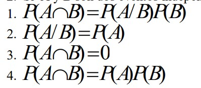

# Primer punto


afirmaciones:


1- La probabilidad de seleccionar a un hombre es menor que la probabilidad de seleccionar a una mujer

probabilidad de seleccionar un hombre:

```{r}
phombre<- (100+150+50)/500
phombre
```

probabilidad de seleccionar una mujer:

```{r}
pmujer<- (100+50+50)/500
pmujer
```


```{r}
phombre < pmujer
```

La probabilidad de seleccionar a un hombre NO es menor que la probabilidad de seleccionar a una mujer.

2- La probabilidad de seleccionar a un hombre de Fisiología es mayor que la de seleccionar a una mujer de
Fisiología.

```{r}
pHombreFis <- 150/500
pHombreFis
```


```{r}
pMujerFis <- 50/500
pMujerFis
```

```{r}
pHombreFis > pMujerFis
```

La probabilidad de seleccionar a un hombre de fisioligia SI es mayor que la de seleccionar una mujer de fisiologia.

3- La proporción de estudiantes de Entomología es mayor que la de estudiantes de Fitomejoramiento

```{r}
propEnt <- 100/500
propEnt
```

```{r}
propFito <- 200/500
propFito
```

```{r}
propEnt > propFito
```

La proporción de estudiantes de Entomología NO es mayor que la de estudiantes de Fitomejoramiento

4- Si se selecciona al azar un estudiante del grupo de los hombres, la probabilidad de que sea de
Fitomejoramiento es menor que la probabilidad de que sea seleccionado de Fisiología.

```{r}
fitoDadoHombre <- 100/300
```

```{r}
FisioDadoHombre <- 150/300
```

```{r}
fitoDadoHombre < FisioDadoHombre
```


# Segundo Punto

2. Si A y B son dos eventos independientes, entonces cuál de las siguientes igualdades se cumple:



Cuando los eventos a y B son independientes, se cumple que:

$$
p(A \cap B) = P(A)*P(B)
$$
Tambien, gracias a la definicion de condicional tenemos que

$$
P(A/B) = \frac{P(A \cap B)}{P(B)}
$$

Si reemplazamos:

$$
P(A/B) = \frac{ P(A)*P(B)}{P(B)}
$$
$$
P(A/B) =  P(A)
$$


# Tercer punto

 A continuación se presenta una muestra aleatoria de las alturas promedio en centímetros para tres especies
de árboles, junto con su desviación estándar y tamaño poblacional:


```{r}
CVAlnus <- 5.8155/76.6
CVAcacia <- 5.6214/22.6 
CVSambucus <- 7.0619/31.8

coeficientes <- c(CVAlnus,CVAcacia,CVSambucus)
coeficientes <- coeficientes*100
coeficientes
max(coeficientes)
```

La especie de arbol más homogenea respecto a su altura es Alnus Acumunata, dado que el coeficiente de variación de los resultados de altura de una muestra aleatoria es el menor de las tres especies.

# cuarto punto

4. Explique brevemente en que consiste el coeficiente de curtosis:

El coeficiente de curtosis nos dice que tanto se desvía una distribucion experimental respecto a la distribución normal en cuanto a su dispersión, dado que permite caracterizar que tan ancha y achatada o que tan aguda y puntuda es la distribución experimental comparada con la normal. Teniendo un valor asintotico para la distribucion normal de k=3.

* k < 3 achatada o pesada en los hombros.
*  k > 3 aguda y puntuda.

# quinto punto

5. Clasifique las siguientes situaciones en la escala de medición correspondiente:

Producción de lechugas por parcela: variable cuantitativa, en donde existe un cero (ninguna lechuga se produce).

 Variedades de gusano (USDA, Campo, Resisitente). cualitativa nominal, dado que no hay un orden definido.
 
 Clasificación según altura de una especie de árbol (baja, media y alta). ordinal

Numero de tuberculos contaminados con una bacteria. Continua, en donde existe un cero (ningun tuberculo fue infectado) 

# Sexto punto

. Una muestra de las cantidades mensuales de dinero que destina a sus alimentos un ciudadano de la tercera edad que vive solo sigue aproximadamente una distribución de frecuencias simétrica. La media muestral es de $150 (dólares) y la desviación estándar es $20. Del contexto, determine aproximadamente entre qué cantidades está por lo menos el 68% de los gastos mensuales en alimentos?


```{r}
k <- sqrt(-(1/(0.68-1)))
```

```{r}
superior <- 150 + (1.7*20)
superior
iferior <- 150 - (1.7*20)
iferior
```

la respuesta mas cercana es C


# septimo punto

En Cenicafé el salario medio por hora para cada uno de los 15 empleados que trabajan en el área de producción es de 39.000, para cada uno de los 9 empleados que trabajan en el área de mercado es 30.000 y los 13 que trabajan en investigación es de $25000. El salario medio para todos los empleados es:


```{r}
promedioTodos <- ((39000*15)+(30000*9)+(25000*13))/(15+9+13)
promedioTodos
```

La respuesta es D

# Octavo punto

A que es igual $P(A \cup B \cup C \cup D)$

$$
=P(A)+P(B)+P(C)+P(D)-P(A\cap B)- )-P(A\cap C)- P(A\cap D)- P(B \cap C)-P(B\cap D)-P(C\cap D)+P(A\cap B\cap c\cap D)
$$

# noveno punto

Con que medidas de localización coincide la mediana


Percentil 50 y cuartil 2


# Decimo

 Una urna contiene 4 bolas rojas y 3 bolas blancas. Se extraen cuatro al azar sin reemplazo, cuál es la
probabilidad de que la cuarta bola que se extrae sea de color rojo?

```{r}
rojo <- 4/7
rojonuevamuestra <- 1/4
```

