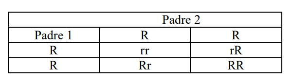
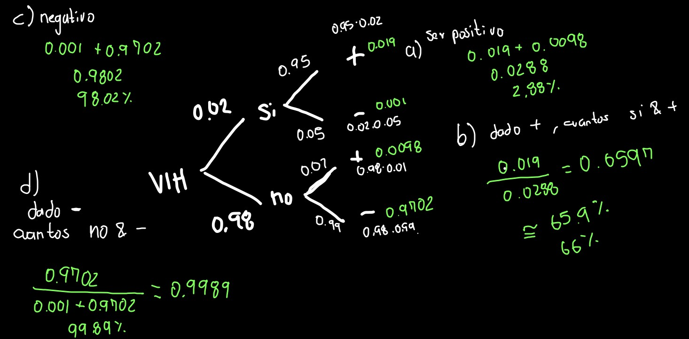
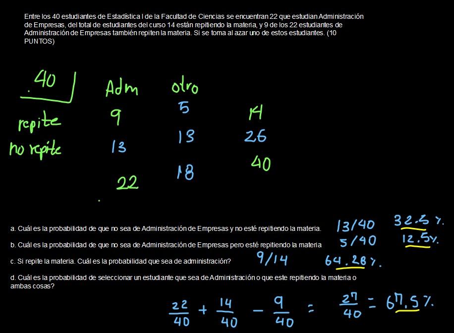

# Primer punto

 Los datos adjuntos corresponden a muestras de aguacate a las que se les midieron las variables de etileno y tasa de respiración en el tiempo. 
Haga el siguiente análisis usando R, pegue el código usado.

a. Con los datos construya un boxplot para la variable tasa de respiración en el tiempo e interprete el gráfico.


Primero importamos los datos:

```{r, warning = FALSE, message = FALSE}
library(readxl)
etilenonuevo <- read_excel("./etilenonuevo.xls")
```

Luego hacemos el boxplot:

```{r}
tasa <- etilenonuevo$tasaderespiracion
boxplot(tasa)

quantile(tasa)
```

El boxplot presenta una distribucion aproximadamente simetrica alrededor de la mediana, teniendo en cuenta la mayor distancia entre el primer cuartil y la mediana que entre el tercer cuartil y la mediana, esto indica una concentracion de los resultados experimentales en el rangon entre el primer y segundo cuartil.  También desde el gráfico se observa un mayor bigote superior que el inferior, y un dato atípico, el valor máximo. Esto indica un ligero sesgo hacia la cola derecha, podemos compararlo con una distribucion normal:

```{r}

par(mfrow = c(1,2))
boxplot(tasa)
boxplot(
  rnorm(length(tasa), 
        mean = mean(tasa),
        sd = sd(tasa)
        )
  )

```

y calcular el momento de sesgo para retar esta afirmación:

```{r}
library(e1071)
skewness(tasa)
library(moments)
skewness(tasa)
```

A pesar de que hay alta concentracion de datos entre el cuartil 1 y la mediana, los calculos de los momentos de sesgo nos dices que hay ligero sesgo hacia la cola izquierda.

b. Con la variable tasa de respiración construya una tabla de frecuencias completa que incluya intervalos de clase, frecuencias absolutas, frecuencias acumuladas, frecuencias relativas y relativas acumuladas.

Primero determinamos la cantidad de intervalos con la ecuacion de sturges:
$$
\begin{array}{c}
k = 1 + 3.322 \;*\;log_{10} (n)
\end{array}
$$

```{r}
length(tasa)
```


$$
\begin{array}{c}
k = 1 + 3.322 \;*\;log_{10} (n)
\end{array}
$$
```{r}
k <- 1 + (3.322 * log10(length(tasa)))
k
round(k,0)
```

Ahora podemos calcular la longitud del intervalo

$$
\begin{array}{c}
longitud \; del \; intervalo = \frac{max(tasa)-min(tasa)}{9}
\end{array}
$$
```{r}
LongInt <- (max(tasa)-min(tasa))/9
LongInt
```

calculamos los minimos
```{r}

mins <- seq(min(tasa), 
            min(tasa)+((LongInt))*8,
            by = LongInt)

```


Luego los maximos
```{r}
maxs <- mins + LongInt

TDF <- data.frame(
  min = mins,
  max = maxs
)
TDF
```


y una vez los tenemos podemos contar cuantos entran dentro de cada intervalo

```{r}
for(i in 1: nrow(TDF)){
  
  TDF$fi[i] <- length(
    which(
TDF$min[i] <= tasa & tasa <= TDF$max[i]
    )
  )
  
}
TDF
```

calculamos la relativa

```{r}
TDF$fr <- round(TDF$fi/length(tasa),2)
TDF
```

Una vez tenemos las frecuencias absolutas y relativas, podemos calcular las acumuladas de la siguiente manera:

* Primero para la frecuencia absoluta acumulada$(F_i)$:

```{r}
for(i in 1:nrow(TDF)){
  
  TDF$Fi[i] <- sum(TDF$fi[1:i]) 
  
}

```

* También para la frecuencia relativa acumulada$(F_r)$:

```{r, echo =F}
options(knitr.table.format = "latex")
```


```{r}
for(i in 1:nrow(TDF)){
  
  TDF$Fr[i] <- sum(TDF$fr[1:i]) 
  
}

```

Una vez hemos calculado todas las frecuencias, podemos imprimir la tabla final:

```{r, echo  = F}
TDF2 <- TDF
colnames(TDF2) <- c('min.',
                   'max.',
                   'f~i~',
                   'f~r~',
                   'F~i~',
                   'F~r~'
                   
                   )
```
\onecolumn
```{r}
knitr::kable(TDF2,"simple") 
```

\twocolumn


c. Calcule las medidas descriptivas básicas con la variable etileno en una tabla, debe incluir (media, cuartil1,
cuartil 3, mediana, moda, varianza, desviación estándar, rango, coeficiente de variación, sesgo y curtosis).

```{r}
etileno <- etilenonuevo$etileno
```

```{r}
library(e1071)
moda <- function(x) {                    
  v <- unique(x)
  t <- tabulate(match(x, v))
  v[t == max(t)]
}

tablaC <- data.frame(medidas =  c ('media',
                                   'cuartil1',
                                  'cuartil 3', 
                                  'mediana', 
                                  'moda', 
                                  'varianza',
                                  ' desviación estándar', 
                                  'rango superior', 
                                  'rango inferior', 
                                  'coeficiente de variación', 
                                  'sesgo' ,
                                  'curtosis'),
                       valor = round(c(mean(etileno),
                                 quantile(etileno)[2],
                                 quantile(etileno)[4],
                                 median(etileno),
                                 NA,
                                 var(etileno),
                                 sd(etileno),
                                 max(etileno),
                                 min(etileno),
                                 sd(etileno)/mean(etileno)*100,
                                 skewness(etileno),
                                 kurtosis(etileno)
                                 ),2)
                     )

```
\newpage
\onecolumn
```{r}
knitr::kable(tablaC,"simple") 
```

\twocolumn

d. Interprete las medidas obtenidas para la variable de interés. 

el valor medio de etileno encontrado en la muestra de aguacates es de 108.98

El 25% de los aguacates tienen un valor de etileno entre 1.38432 y 65.13

el 75% de los aguacates analizados tienen un valor de etileno entre   1.38432 y 157.85

el 50% de los aguacates analizados tienen un valor de etileno entre 1.38432 y 102.2, mientras que la otra mitad tienen un valor de etileno entre 102.2 y 274.21.

no hay un valor mas frecuente entre los resultados de etileno.

la raiz del cuadrado de la desviacion promedio entre el etileno de todos los aguacates y el contenido promedio de etileno es de 67.04 unidades.

los valores de etileno en aguacate estan entre 1.38 y 274.21.

la muestra de aguacates analizada es heterogenea dado que su coeficiente de variacion es de 61.52%

La distribucion de resultados de contenido de etileno en aguacate presenta un sesgo hacia la cola derecha, y un ligero ensanchamiento en los hombros respecto a una distribucion normal.

# Segundo punto


Gregor Mendel fue un monje que sugirió una teoría de la herencia en 1865 con base en la genética.
Identificó a los individuos heterocigotos por el color de la flor que tenía dos alelos (uno r=alelo recesivo
color blanco, y uno R=alelo dominante color rojo). Cuando se acoplaron estos individuos, se observó que
3/4 de la descendencia tenían flores rojas y 1/4 flores blancas. En la tabla se resume este acoplamiento;
cada padre da uno de sus alelos para formar el gen de la descendencia. (10 PUNTOS)



Suponemos que cada padre tiene las mismas probabilidades de dar cualquiera de los dos alelos y que, si
cualquiera de los dos o ambos alelos en un par son dominantes (R), la descendencia tendrá las flores rojas.

a. Cuál es la probabilidad de que una descendencia de esta unión tenga por los menos un alelo dominante?
$$
p(R) = 0.25+0.25+0.25
$$

```{r}
(0.25+0.25 +0.25)/1 
```


b. Cuál es la probabilidad de que una descendencia tenga por los menos un alelo recesivo?
$$
p(r) = 3 * 0.25
$$


```{r}
3*0.25
```

c. Si la descendencia tiene las flores rojas, cuál es la probabilidad de que una descendencia tenga un alelo
recesivo?

$$
p(r/R) = 2 * 0.25
$$

```{r}
2*0.25
```

d. Si la descendencia tiene las flores blancas, cuál es la probabilidad de que una descendencia tenga un alelo
dominante?

$$
p(R/r) =0
$$

```{r}
0
```

# Tercer punto

3. En cierto grupo poblacional 2% de todos los adultos tienen el virus del SIDA. La prueba utilizada para
detectar el virus tiene cierto margen de error. El 95% de aquellos que tienen el virus presentan positivo en
la prueba, mientras que el 1% de los que no están infectados dan positivo en la prueba. Si se selecciona al
azar una persona de este grupo y se le aplica la prueba (|10 PUNTOS)


a. ¿cuál es la probabilidad de que ésta sea positiva?

b. Si la prueba es positiva. Cuál es la probabilidad de que tenga el virus del sida.

c. ¿Cuál es la probabilidad de que ésta sea negativa?

d. Si la prueba es negativa. Cuál es la probabilidad de que no tenga el virus del sida.



# Cuarto punto

Entre los 40 estudiantes de Estadística I de la Facultad de Ciencias se encuentran 22 que estudian Administración de Empresas, del total de estudiantes del curso 14 están repitiendo la materia, y 9 de los 22 estudiantes de Administración de Empresas también repiten la materia. Si se toma al azar uno de estos estudiantes. (10 PUNTOS)


