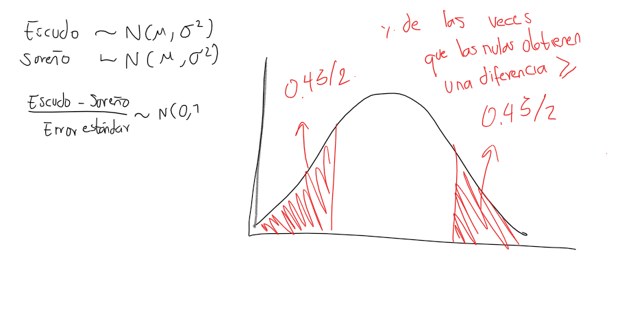
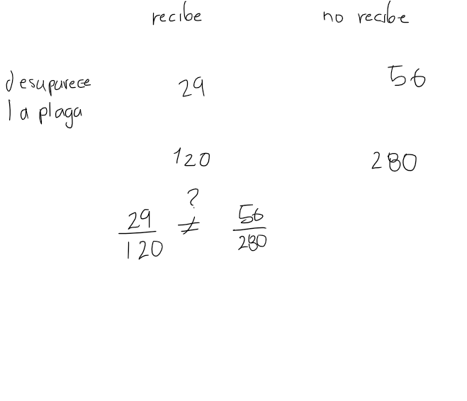

# primer punto

## a

El gobierno otorga fondos para los departamentos de agricultura de nueve universidades para probar las capacidades de rendimiento de dos nuevas variedades de trigo. Cada variedad se planta en parcelas de área igual en cada universidad y el rendimiento, en kilogramos por  parcela para una muestra tomada aleatoriamente, se registra como sigue:

```{r}
sureno <- c(39,	23,	35,	41,	44,	29,	37,	31,	38)
escudo <- c(44,	25,	31,	38,	50,	33,	36,	40,	43)
```

Pruebe si la variedad escudo es mejor en cuanto a rendimiento en Kg. Suponga que las poblaciones de las cuales fueron tomadas las muestras se distribuyen normalmente y son independientes. Calcular el  p valor  y concluir. Usar $\alpha = 0.05$ . (10 PUNTOS)


Primero revisamos si las varianzas son diferentes: 

```{r}
var.test(sureno,escudo)
```
Dado que la relación entre las varianzas es diferente a 1, usamos el argumento `var.equal=F` en la función `t.test`

```{r}
t.test(sureno,escudo,var.equal = F,conf.level = 0.95,alternative = c("two.sided"))
```
$$
H_0 : \text{la diferencia es igual a cero}
$$
$$
H_1 : \text{la diferencia es diferente de cero}
$$

Cuando se cumple la hipótesis nula, es decir que el peso medio de la variante sureño y el peso medio de la variante escudo son iguales, se obtiene una diferencia igual o mayor a la obtenida al experimento un 45.39 % de las veces. Es decir, una diferencia tal como la observada en el experimento, se podría haber observado aún así los pesos medios de las dos variantes fueran iguales. En este caso, el resultado de esta proporción es lejano al esperado para afirmar que la variedad escudo tiene un mayor rendimiento en kg, uno menor del 5 %.


## b

En un cultivo atacado por una plaga, una compañía farmacéutica bien conocida estudió 2000 plantas para determinar  si el  nuevo insecticida de la compañía era efectivo después de dos días. A 120 plantas que tenían la plaga se les administro el nuevo insecticida, de estas en 29 desapareció la plaga dentro de dos días. Entre 280 plantas que tenían el insecto pero que no recibieron el nuevo insecticida, en 56 desapareció la plaga dentro de dos días. ¿Hay alguna indicación significativa que apoye la afirmación de la compañía de la efectividad del nuevo insecticida?, utilice una confianza del 95%  e interprete el intervalo. (10 PUNTOS)




Cargamos los datos:

```{r}
x <-c(29,56)
n <- c(120,280)
prop.test(x,n,conf.level = 0.95)
```

Dado que el intervalo de cofianza para la diferencia de proporciones contiene el cero, se puede afirmar con un 95% de confianza que el uso del insecticida no presenta resultados significativamente diferentes al caso en el que no se usa, ya que la proporción de plantas que presentan mejoría respecto al total, no es diferente a cuando no se usa el insecticida.

