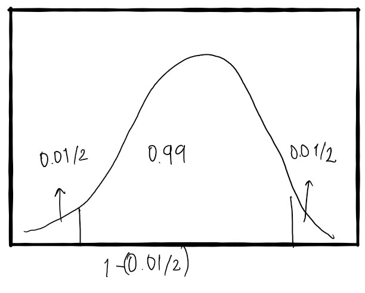
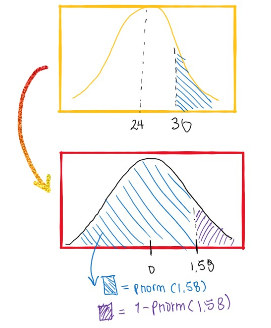
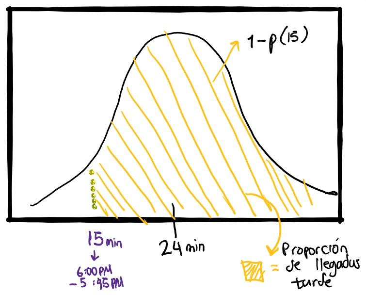
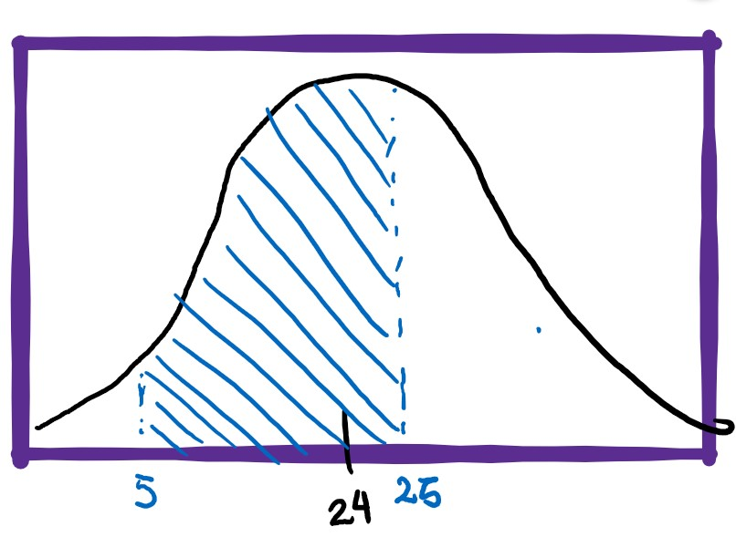
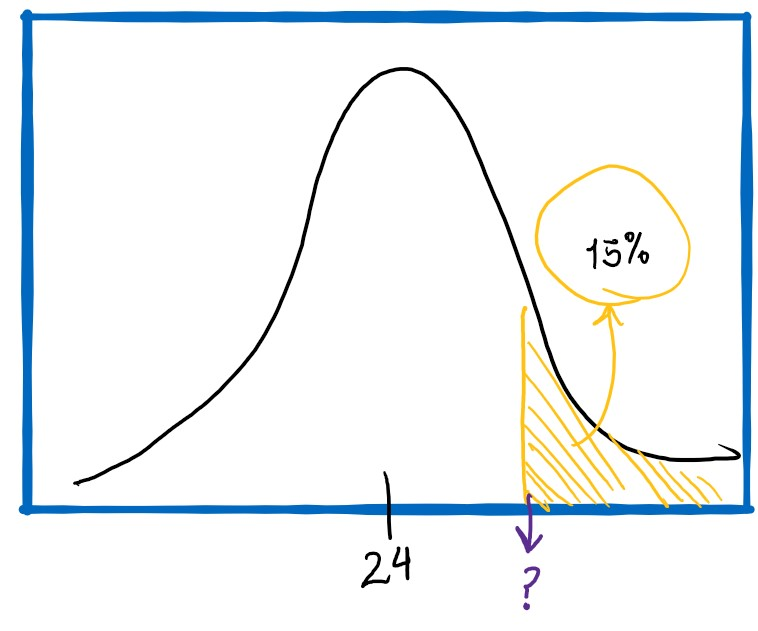

# Punto 1

En un estudio realizado en una finca donde se sembraron árboles de la misma especie 20 en total. Se obtuvieron los siguientes resultados para el diámetro en centímetros de los árboles después de seis meses de sembrados:

## a 
Seleccione una muestra aleatoria sistemática de tamaño 8 y estime el parámetro de la media. Construya un intervalo del 99% de confianza para la media, hallar el error de muestreo e intérprete el resultado claramente (tome los 3 primeros aleatorios para el arranque). Detallar la muestra seleccionada.

Antes de empezar cargamos los datos:

```{r}
tabla <- data.frame(
  No = c(1:20) ,
  diametro = c( 18, 12, 15, 13, 15,17,18,12,18,14,13,16,20,17,16,14,12,19,17,15),
    aleatorio = c(0.268,0.037,0.629,0.349,0.425,0.773,0.062,0.458,0.405,0.131,0.319,0.35,0.561,0.714,0.022,0.895,0.386,0.04,0.149,0.225
)
)
knitr::kable(tabla)
```

Primero, podemos encontrar la relación entre el tamaño de muestra y la población:

```{r}
N <- 20
n <- 8
a <- N/n
a
```
Aproximando al número entero inmediatamente mayor:

```{r}
a <- 3
```

Para la selección de muestras, podemos crear una matriz:

```{r}
mat <- matrix(c(1:20,1:4),
              ncol = a,
              byrow = T)
mat
```
Teniendo que cada fila de la matriz es un intervalo, se selecciona la posicion que tiene el menor número aleatorio de los primeros tres, en este caso es el 0.037 que corresponde a la segunda posición:

```{r}
muestraID <- mat[,2]
muestraID
```
```{r}
muestra <- tabla$diametro[muestraID] 
muestra
```
Podemos entonces calcular la media:

```{r}
mean(muestra)
```
la varianza:

```{r}
var(muestra)
```
Y el estimador para la varianza de la media:

```{r}
estimVar <- ((1-(length(muestra)/nrow(tabla)) )/length(muestra))*var(muestra)

estimVar
```
Dado que la muestra es 8, puede compararse el uso de la distribucion normal estándar y la distribución t para el intervalo de confianza:

### usando normal estándar



```{r}
qnormal <- qnorm(1-(0.01/2))
qnormal
```
Usando el cuantil y el estimador de varianza podemos calcular el intervalo de confianza:

```{r}
inferiorNorm <- mean(muestra) - (sqrt(estimVar)*qnormal) 
inferiorNorm 
SuperiorNorm <-  mean(muestra) + (sqrt(estimVar)*qnormal) 
SuperiorNorm
```


### usando t student

```{r}
qt <- qt(1-(0.01/2), df = length(muestra -1))
qt
```
De nuevo, usando el cuantil y el estimador de la varianza

```{r}
inferiort <- mean(muestra) - (sqrt(estimVar)*qt) 
inferiort 
Superiort <-  mean(muestra) + (sqrt(estimVar)*qt) 
Superiort
```
### Error de muestreo:

Podemos calcular el error de muestreo de la forma:

```{r}
sqrt(estimVar)/mean(muestra)*100
```
Al escoger una muestra aleatoria de los diametros de los arboles despues de seis meses de sembrados, se obtiene un valor promedio de 13.87 $\pm$ 1.73 cm  con un error de muestreo del 3.72 %.

## b

Seleccione una muestra aleatoria simple de tamaño 10 y estime el parámetro del total. Construya un intervalo del 95% de confianza, calcule el porcentaje de error de muestreo e interprete el resultado. Detallar la muestra seleccionada.

Se puede escoger entre el método fan muller y el coordinado negativo. Para este caso utilizamos el coordinado negativo ordenando las muestras en orden ascendiente del número aleatorio asociado a cada fila:

```{r}
tablaCorNegativo <- tabla[with(tabla, order(aleatorio)),]
knitr::kable(tablaCorNegativo)
```

Y se seleccionan las primeras 10:

```{r}
tablaCorNegativo[1:10,]
```

Podemos entonces calcular el total:

```{r}
sum(tablaCorNegativo[1:10,2])
```
Y su correspondiente estimador:

```{r}
estimadorTotal <- sum(tablaCorNegativo[1:10,2])/(10/20)
estimadorTotal
```
a su vez la varianza de la muestra:

```{r}
var(tablaCorNegativo[1:10,2])
```
y el estimador de varianza:

```{r}
estimvarTotal <- 20^2 *(1 - 10/20)/(10) * var(tablaCorNegativo[1:10,2])
estimvarTotal
```
Para determinar el intervalo de confianza para el total con un 95 %

```{r}
ztotal <- 1.96
```
usando el estimador y el cuantil podemos calcular el intervalo:

```{r}
inferiortotal <- estimadorTotal - (sqrt(estimvarTotal)*ztotal) 
inferiortotal
Superiortotal <-  mean(estimadorTotal) + (sqrt(estimvarTotal)*ztotal) 
Superiortotal
```
Con un 95$\%$ de confianza se puede reportar que el total de diametros en la población se encientra entre 288 y 332 cm.

# Segundo punto 

Un estudiante va todos los días de su trabajo a clase de Estadística en  la universidad Nacional. El tiempo promedio para un viaje de ida es 24 minutos, con una varianza de 14.44 minutos. Suponga que la distribución de los tiempos de viaje está distribuida normalmente. (usar dos decimales en los valores estandarizados Z).

## a

Cuál es la probabilidad de que en un viaje tome al menos ½ hora.

media hora son 30 minutos:

Teniendo en cuenta que la variable se distribuye como: 


$$
\text{tiempo} \sim N(\mu = 24,\sigma^2 =14.44)
$$
Se puede calcular el cuantil $z$ para 30 minutos de la siguiente manera:

$$
z = \frac{x - \mu}{\sigma}
$$

```{r}
z <- (30-24)/sqrt(14.44)
z
```
teniendo el cuantil de $1.578947 \approx 1.58$

```{r}
z <- round(z,2)
z
```

podemos calcular la probabilidad de que obtener un valor mayor o igual al experimental, es decir, $1-P(z)$:

```{r}
p <- 1-pnorm(1.58)
p
p2 <- 1-pnorm(30, mean = 24, sd = sqrt(14.44))
p2
```
La probabilidad de que el estudiante se demore en su viaje del trabajo a la universidad un tiempo de por lo menos $\frac{1}{2}$ hora es de $0.057$




## b 
Si la clase inicia a las 6:00 PM y él sale del trabajo para la universidad a las 5:45 PM, ¿Qué porcentaje de las veces llega tarde a la universidad?

Para saber esto, debemos tener en cuenta que el viaje no debe durar más de 15 minutos.

Lo que pregunta el enunciado, es la probabilidad de obtener un tiempo de viaje mayor a 15 minutos:



Podemos entonces calcular la probabilidad:

```{r}
p15 <- 1-pnorm(15, mean = 24, sd = sqrt(14.44))
p15
p15*100
```
Dado que la clase inicia a las 6:00 PM y el estudiante sale de trabajar a las 5:45 PM, el porcentaje de veces que llega tarde a la clase es de $99.1\%$.

## c

Si sale de su trabajo a las 6:15 PM y el profesor hace quiz de 6:20 PM a 6:40 PM. Cuál es la probabilidad de que el estudiante pierda la oportunidad de presentar el quiz ?

Podemos calcular el tiempo de viaje en cada limite de tiempo del quiz:

$$
6:20 - 6:15 = 5 \; minutos
$$

$$
6:40 - 6:15 = 25 \; minutos
$$

Entonces debemos hallar:



Para hallar el area entre los límites 5 y 25 podemos:

1. hallar el area de menos infinito a 25
2. hallar el aria de menos infinito a 5
3 . restarle el area de menos infinito a 5 al area de menos infinito a 25

```{r}
pquiz <- pnorm(25, mean = 24 , sd = sqrt(14.44)) - pnorm(5,mean = 24 , sd = sqrt(14.44))
pquiz
```
La probabilidad de que el estudiante puerda la oportunidad de presentar el quiz agendado de 6:20 PM a 6:40 PM es de 0.60. 

d. Encuentre la longitud de tiempo por arriba de la cual encontramos el 15% de los viajes más lentos. 

Los viajes más lentos, son aquellos que duran más tiempo. podemos entonces calcular el area de todo excepto lo resaltado:




```{r}
tLentos <- qnorm(1-0.15, mean = 24, sd = sqrt(14.44))
tLentos
```


El 15% de los viajes más lentos, tienen un tiempo de viaje de por lo menos 27.9  minutos.

# Tercer punto


