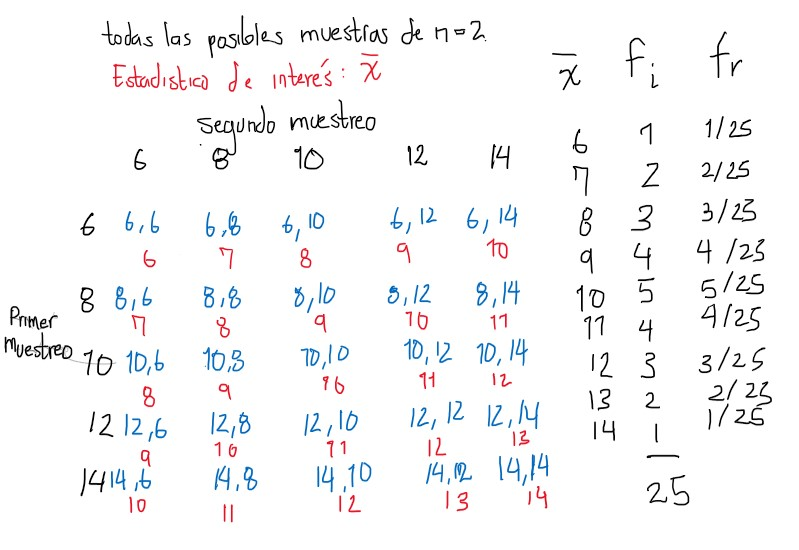
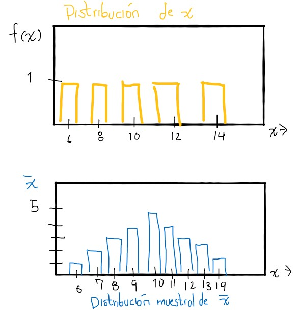

# Distribuciones de muestreo

1. De una población finita de tamaño N, se extraen de manera aleatoria todas las muestras posibles de tamaño n
2. Se calcula la estadística de interés para cada muestra.
3. Listar en una columna los distintos valores observados de la estadpistica y en otra columna las frecuencias correspondientes de cada valor observado.

## Muestreo a partir de una distribución normal

Cuando el muestreo se realiza a partir de una población que sigue una distribución normal, la distribución de la media muestral tiene las siguientes propiedadesÑ

1. la distribución de $\bar{x}$ será normal. 

2. La media, $\mu_{\bar{x}}$ de la distribución de $\bar{x}$ será igual a la media de la población de la cual se extrajo.

3. La varianza $s^2_{\bar{x}}$ de la distribución de $\bar{x}$ será igual a la varianza de la población dividida entre el tamaño de muestra.

# Teorema del límite central

Si $\bar{x}$ es la media de una muestra aleatoria de tramaño n que se toma de una población con media $\mu$ y varianza finita  $\sigma^2$, entonces la variable $z_n = \tfrac{\sqrt{n}(\bar{x} - \mu)}{\sigma}$ tiende a distribuirse como una normal estándar a medida que n tiende a infinito.

$$
z_n = \frac{\sqrt{n}(\bar{x} - \mu)}{\sigma}
$$

## Ejemplo: distribuciones de muestreo

Para una población de tamaño 5

$$
N = 5
$$
en donde la variable $x$ es la edad de un niño

$$
x_1 = 6 \; , \; x_2 = 8 \; , \; x_3 = 10 \; , \; x_4 = 12 \; , \; x_5 = 14
$$

la media se puede calcular como:


$$
\mu = \frac{\sum_{i = 1}^n x_i}{N} = \frac{ 6 + 8 + 10 + 12 + 14}{5} = 10
$$

Y la varianza:

$$
\sigma^2 = \frac{\sum_{i = 1}^n (x_i- \mu )^2}{N} = \frac{1}{5} (6-10)^2 + (8-10)^2 + (10-10)^2 \\
+ (12-10)^2 + (14-10)^2
$$

$$
\sigma^2 = \frac{\sum_{i = 1}^n (x_i- \mu )^2}{N} = \frac{1}{5} (16 + 4 + 0 + 4 + 16) = \frac{40}{5} = 8
$$
Si queremos hallar la distribucion de muestreo, debemos recolectar todas las posibles muestras de una población de tamaño 5.

para tomar todas las posibles muestras, las tomamos tanto con orden como con reemplazo, el numero de muestras posibles es:

$$
N^n = 5^2 = 25
$$
Podemos entonces, sacar todas las posibles muestras de tamaño 2, calcular el estadístico de interés, en este caso $\bar{x}$, listarlo y determinar su frecuencia relativa:



y graficar las frecuencias para evaluar las distribuciones de la variable y del estadistico $\bar{x}$ de las muestras.



Es importante realizar una muestra probabilistica para tener en cuent que cuando otro experimentador saque una muestra diferente tendra resultados diferentes.

Podemos calcular la media de $\bar{x}$, $\mu_{\bar{x}}$:

$$
\mu_{\bar{x}} = \frac{\sum_{i=1}^{25}x_i}{N^n} =\frac{\sum_{i=1}^{25}x_i}{25}
$$

$$
\mu_{\bar{x}} = \frac{250}{25} = 10
$$

La media muestral, coincide con la media poblacional.

$$
\mu_{\bar{x}} = \frac{250}{25} = 10
$$

$$
\sigma^2_{\bar{x}} = \frac{\sum_{i=1}^{N^n} (\bar{x} - \mu_{\bar{x}})^2 }{N^n}
$$
$$
\sigma^2_{\bar{x}} =\frac{ (6-10)^2 + 2\cdot(7-10)^2 + \dots + (14-10)^2}{25}
$$

$$
\sigma^2_{\bar{x}} =\frac{100}{25} = 4
$$

El resultado anterior nos permite observar que la varianza de la muestra, es igual a la varianza de la población dividida por el tamaño de muestra.

Tenemos los resultados:

$$
\mu_{\bar{x}} = \mu
$$
$$
\sigma^2_{\bar{x}} = \frac{\sigma^2}{n}
$$

### Error estándar:

el error estándar es la raíz de la varianza:

$$
\text{error estandar =} \frac{\sigma}{\sqrt{n}}
$$

El error estándar es útil en los intervalos de confianza

## Cuando la población presenta una distribución normal

1. la distribución de $\bar{x}$
2. la media $\mu_{\bar{x}}$ de la distribución de $\bar{x}$ será igual a la media de la población de la cual se extrajo.
3. La varianza $s^2_{\bar{x}}$ de la distribución de $\bar{x}$ será igual a la varianza de la población dividida entre el tamaño de muestra.

# Muestras aleatorias y distribuciones de muestreo

## Muestra aleatoria

Sea X una caracteristica de interés y $f(x)$ su función de densiad de probabilidad.

Un conjunto de $n$ variables aleatorias, $x_1, x_2, \dots, x_n$ independientes e idénticamente distribuidas se denomina muestra aleatoria

## Estadística

Cualquier función de las variables aleatorias que conforman una muestra aleatoria, de tal forma que al realzar la observación no conteiene valores desconocidos. Se denota con T.

Ejemplos: Sumatoria, media, rango, desviación.

## Distribución de muestreo de una estadística.

Sea T una estadística, la distribución de T es la función de densidad de probabilidad que se obtendría de un número infinito de muestras aleatorias independientes. cada una de tamaño n, provenientes de la población de interés.

# Distribución de muestreo de $\bar{x}$

## Teorema 1: Distribución de muestreo de $\bar{x}$ varianza conocida, normalidad

Sea $x$ una variable normalmente distribuida y $x_1, x_2, \dots , x_n $ una muestra aleatoria, con promedio $E(x_i)= \mu$ y varianza $V(x_i)= \sigma^2$, $i = 1,2, \dots, n$,


Entonces la distribución de $\bar{x}$ es también ***normal**, con promedio $E(\bar{x}) = \mu$ y varianza $\frac{\sigma^2}{n}$

Es decir, si $x \sim N(\mu, \sigma^2)$,
Entonces $\bar{x}  \sim N(\mu, \sigma^2/n)$ de donde

$$
Z = \frac{\bar{x}-\mu}{\frac{\sigma^2}{\sqrt{n}}} \sim N(0,1)
$$

## Teorema 2 (Teorema del límite central):

Sea $x$ una variable con distribución no especificada y $x_1, x_2, \dots , x_n $ una muestra aleatoria, con promedio $E(x_i)= \mu$ y varianza $V(x_i)= \sigma^2$, $i = 1,2, \dots, n$, teniendo $\mu$ y $\sigma^2$ finitas, entonces $\bar{x}$ tiene una distribución que tiende a $\sim t(\mu, s^2/n)$ cuando $n \rightarrow \infty$

Entonces:

$$
T = \frac{\bar{x} - \mu }{s/ \sqrt{n}} \sim \text{t student con n-1 grados de libertad}
$$

## ** observación **

Cuando el tamaño de muestra tiende a infinito (después de 30):

cuando $n \rightarrow \infty$:

$$
z = \frac{\bar{x} - \mu }{s/ \sqrt{n}} \sim N(0,1)
$$

# Teorema 3: Distribución de muestreo para la media $\bar{x}$ con varianza desconocida.

Sea $x$ una variable que se distribuye como una distribución normal, $x \sim N(\mu, \sigma^2)$ entonces la media se distribuye como: $\bar{x} \sim t(\mu, s^2/n)$. De manera que el estadistico se calcula:

$$
T = \frac{\bar{x} - \mu}{s/\sqrt{n}} \sim t-student \; (n-1\; g.l.)
$$
Y cuando la muestra es más grande, $n \rightarrow \infty$, el estadístico es:

$$
z = \frac{\bar{x} - \mu}{s/\sqrt{n}} \sim N(0,1)
$$

# Teorema 4. Distribucion de muestreo para varianza $\sigma^2$

Si $x \sim N(\mu, \sigma^2)$ entonces:

$$
\chi^2 = \frac{(n-1)\cdot s^2}{\sigma^2} \sim \chi^2_{(n-1)}
$$

## Problemas

Dado que $\chi^2$ es asimetrica, las estimaciones no son tan buenas como cuando se trabaja con distribuciones simetricas. El intervalo de confianza va a ser amplio debido al sesgo de la distribución.

# Teorema 5: Distribucion de muestreo para diferencia de medias

Si $x \sim N(\mu_x, \sigma^2_x)$ y $y \sim N(\mu_y, \sigma^2_y)$ y se toman dos muestras aleatorias independientes de tamaños $n_x$ y $n_y$ respectivamente

## a) Si $\sigma^2_x$ y $\sigma^2_y$ son conocidas

$$
Z = \frac{\bar{x}-\bar{y}-(\mu_x-\mu_y)}{\sqrt{\frac{\sigma^2_x}{n_x}+\frac{\sigma_y^2}{n_y}}} \sim N(0,1)
$$

## b) Si $\sigma^2_x$ y $\sigma^2_y$ son conocidas e iguales, $\sigma^2_x = \sigma^2_y = \sigma^2$  entonces (Para saber si son iguales,hay hacer una prueba de hipótesis o calcular un intervalo de confianza para confirmar)

$$
z = \frac{\bar{x}-\bar{y}-(\mu_x-\mu_y)}{\sigma \sqrt{\frac{1}{n_x}+\frac{1}{n_y}}} \sim N(0,1)
$$
## c) Si $\sigma^2_x$ y $\sigma^2_y$ son desconocidas, y el tama;o de muestra lo sufciientemente grande como para usar la convergencia de la distribucion t a la normal se tiene que 

$$
z = \frac{\bar{x}-\bar{y}-(\mu_x-\mu_y)}{\sqrt{\frac{s^2_x}{n_x}+\frac{s_y^2}{n_y}}} \sim_{n\rightarrow \infty} N(0,1)\ 
$$

## c) Si $\sigma^2_x$ y $\sigma^2_y$ son desconocidas, pero supuestamente iguales, y el tamaño de muestra no es lo suficientemente grande como para usar la convergencia de la distribución t a la normal se tiene que

$$
T = \frac{\bar{x}-\bar{y}-(\mu_x-\mu_y)}{S_p \sqrt{\frac{1}{n_x}+\frac{1}{n_y}}} \sim t_{(n_x+ n_y -2)}
$$

En donde 

$$
S^2_p = \frac{(n_x-1)S^2_x+(n_y-1)S_y^2}{n_x+n_y -2} 
$$
Es la varianza conjunta estimada.

# Teorema 6. Distribución para la proporción

Sea $X$ el número de elementos (objetos o individuos) que presentan la característica y $n$ el número total de elementos investigados; la proporción estimada se calcula mediante el cociente entre el número de elementos en la muestra que presentan la característica de interés )$x$ entre n. Ésta cantidad se denota con $\hat{p} = \frac{x}{n}$

$$
\hat{p} \sim N(P, \frac{PQ}{n})
$$

es decir:

$$
Z = \frac{\hat{P}-P}{\sqrt{\frac{PQ}{n}}} \sim N(0,1)
$$
# Teorema 7. Distribución para la diferencia de proporciones

sea X el núimero de elementos que presentan la característica en la población 1 y Y el número de elementos que presentan la característica en la población 2, con $n_x$ y $n_y$ el núumero total de elementos investigados en la población 1 y 2 respectivamente. La proporción estimadad de la característica en cada una de las poblaciones es $\hat{P}_x= \frac{x}{n}$ y $\hat{P}_y= \frac{y}{n}$ entonces la distribución para la distribución de proporciones es:

$$
Z = \frac{\hat{P}_x - \hat{P}_y - (P_x - P_y)}{\sqrt{\frac{p_xq_x}{n_x}}+ \sqrt{\frac{p_yq_y}{n_y}}}
$$

# Teorema 8 Distribución para el cociente de varianzas

Si $x \sim N(\mu_x, \sigma^2_x)$ y $x \sim N(\mu_y, \sigma^2_y)$, y se toman dos muestras aleatorias independientes de tamaños $n_x$ y $n_y$ respectivamente:

$$
F = \frac{\frac{S^2_x}{\sigma^2_x}}{\frac{S^2_y}{\sigma^2_y}} = \frac{S^2_x \sigma^2_y}{S^2_y\sigma^2_x} \sim = F_{(n_x -1, n_y-1)}
$$

# Generación de distribuciones de muestreo en `R`

## distribución normal

para generar una muestra aleatoria de una distribución normal con promedio $\mu =121.8$ y desviación estándar $s =14.99$

```{r}
muestra1 <- rnorm(100,121.8, 14.99)
```

### Estimación de momentos de la esperanza de x E(x)

La varianza de x puede expresarse como:

$$
s^2 = E(x^2) = E^2(x) 
$$
Podemos hacer el cálculo en R:

```{r}
m1 <- mean(muestra1)
m2 <- (1/100)*sum(muestra1^2)
emsigma2 <- m2-m1^2
emsigma2
```


