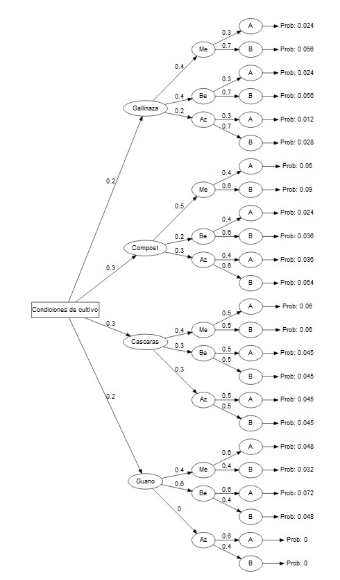
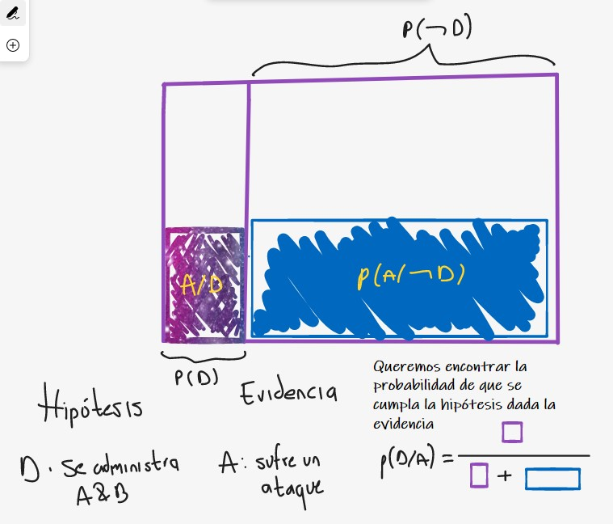
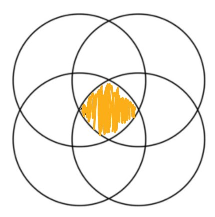
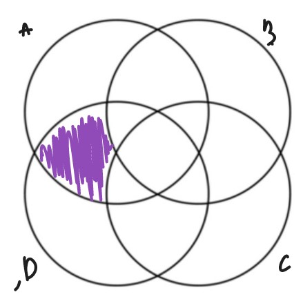

# Primer punto

1. Los agricultores de la sabana de Bogotá realizaron un estudio respecto a la aplicación
de fungicidas y abonos orgánicos y su relación con la presencia de daños por patógenos.
Se utilizó una encesta para recoger la información. La encuesta tenía las siuguientes tres
preguntas:
  1. Qué tipo de abono orgánico utiliza?
    a. Gallinaza
    b. Compost
    c. Cascarilla de arroz+desechos vegetales
    d. Guano
  2. Qué tipo de aplicación de fungicidas utiliza?
    a. Metil Tiofanato 70% (Enovit Metil)
    b. Belanaxil 8% (Galben M)
    c. Azufre 80% (Sufrevit)
  3. Cómo considera la presencia de daños por patógenos?
    a. Alto 
    b. Bajo
    
Los encuestados únicamente escogían un tipo de fungicida y un tipo de abono orgánico.

Todos los encuestados respondieron todas las preguntas. Los resultados encontrados
fueron los siguientes:

1. El 12% de las personas utilizan Metil Tiofanato 70% y Cascarilla de arroz+desechos vegetales. 

2. De las personas que prefieren Cascarilla de arroz+desechos vegetales el 50% encuentran la presencia de daños por patógenos alta independiente del tipo de aplicación de fungicidas. 

3. El 9% de las personas utilizan Belanaxil 8% y Cascarilla de arroz+desechos vegetales.

4. El 40% de los que utilizan Guano, utilizan Metil tiofanato 70%.

5. El 40% de las personas que utiliza Compost encuentran la presencia de daños por patógenos alta sin importar el tipo de fungicidas que se aplique.

6. El 20% de las personas utilizan Gallinaza. 

7. De los que utilizan Gallinaza, el 40% utiliza Metil Tiofanato 70%. 
8. De los que utilizan Gallinaza, el 40% utiliza Belanaxil 8%.

9. El 15% de las personas utiliza Compost y Metil Tiofanato 70%.

10. El 9% de las personas utiliza Azufre 80% y Cascarilla de arroz+desechos vegetales. 

11. El 30% de las personas que utiliza Gallinaza encuentran la presencia de daños por patógenos alta  sin importar el tipo de fungicida.

12. De los que utilizan Guano nadie utiliza Azufre 80%. 

13. El 6% de las personas utilizan Compost y Belanaxil 8%. 

14. De las personas que utilizan Guano el 60% encuentran lapresencia de daños por patógenos alta sin importar el tipo de fungicidas. 

15. El 30% de las personas prefieren Compost.

a. Construya el árbol de la situación anterior y calcule todas las probabilidades en todas
las intersecciones y en todas las ramas del árbol.


```{r}
prob_data <- data.frame(pathString = c(
  'Gallinaza',
  'Compost',
  'Cascaras',
  'Guano',
  'Gallinaza/Me',
  'Gallinaza/Be',
  'Gallinaza/Az',
  'Compost/Me',
  'Compost/Be',
  'Compost/Az',
  'Cascaras/Me',
  'Cascaras/Be',
  'Cascaras/Az',
  'Guano/Me',
  'Guano/Be',
  'Guano/Az',
  'Gallinaza/Me/A',
  'Gallinaza/Me/B',
  'Gallinaza/Be/A',
  'Gallinaza/Be/B',
  'Gallinaza/Az/A',
  'Gallinaza/Az/B',
  'Compost/Me/A',
  'Compost/Me/B',
  'Compost/Be/A',
  'Compost/Be/B',
  'Compost/Az/A',
  'Compost/Az/B',
  'Cascaras/Me/A',
  'Cascaras/Me/B',
  'Cascaras/Be/A',
  'Cascaras/Be/B',
  'Cascaras/Az/A',
  'Cascaras/Az/B',
  'Guano/Me/A',
  'Guano/Me/B',
  'Guano/Be/A',
  'Guano/Be/B',
  'Guano/Az/A',
  'Guano/Az/B'
  ),
 prob = c(0.2,
          0.3,
          0.3,
          0.2,
          0.4,
          0.4,
          0.2,
          0.5,
          0.2,
          0.3,
          0.4,
          0.3,
          0.3,
          0.4,
          0.6,
          0,
          0.3,
          0.7,
          0.3,
          0.7,
          0.3,
          0.7,
          0.4,
          0.6,
          0.4,
          0.6,
          0.4,
          0.6,
          0.5,
          0.5,
          0.5,
          0.5,
          0.5,
          0.5,
          0.6,
          0.4,
          0.6,
          0.4,
          0.6,
          0.4
          ))
# knitr::kable(prob_data)
```

## Creando variables de ayuda

El objetivo de este paso es generar nuevas variables a partir de las entradas originales que van a ayudarnos a definir la estructura requerida para diobujar el arbol.

1. tree_level : el nivel de la rama en la cual se va a dibujar una probabilidad en especifico
2. tree_group: El nombre de la primera rama que se usa para buscar la probabilidad madre.

3 node_type = un nombre unico para construir componentes a medida para la visualizacion.

También creamos la variable llamada`max_tree_level` qUe nos dice el numero total de ramas en el arbol.


```{r, message =FALSE, warning= FALSE}
library(data.tree)
library(dplyr)
library(stringr)
library(DiagrammeR)
prob_data <- prob_data %>% mutate(
                                  tree_level = str_count(string = pathString, 
                                                         pattern = '/')+1,
                                  tree_group = str_replace(string = pathString, 
                                                           pattern = '/.*',
                                                           replacement = ''),
                                  node_type = 'decision_node')

max_tree_level <- max(prob_data$tree_level, na.rm = T)
```

## Encontrando las probabilidades padre

para determinar la probabilidad acumulada para un resultado dado, es necesario multiplicar las probabilidades en ramas secundarias por las probabilidades de las ramas madres asociadas a cada una de ellas.

Para hacer esto, creamos un nuevo data_frame `parent_lookup`, que contiene todas las probabilidades que vienen de nuestra fuente de datos. 

Podemos entonces iterar a traves de los cuatro niveles, tomando las probabilidades de todas las ramas madre. Al final podemos calcular la probabilidad acumulada `overall_prob` al multiplicar a lo largo de todas probabilidades a traves de una secuencia de ramas.


Primero, obtenemos las distintas probabilidades para poder encontrar las probabilidades del nodo madre:

```{r ,message =FALSE, warning= FALSE}
parent_lookup <- prob_data %>% distinct(pathString, prob) 
```

Luego iteramos a lo largo de la primera capa para obtener todas las probabilidades madre.

```{r,message =FALSE, warning= FALSE}
for (i in 1:(max_tree_level -  1)) { # loop through all tree layers to get all immidiate parent probabilities (to calculate cumulative prob)
  
  names(parent_lookup)[1] <-paste0("parent",i)
  names(parent_lookup)[2] <-paste0("parent_prob",i)
  
  for (j in 1:i) {
    
    if (j == 1)  prob_data[[paste0("parent",i)]] <- sub("/[^/]+$", "", prob_data$pathString)
    else if (j  > 1) prob_data[[paste0("parent",i)]] <- sub("/[^/]+$", "", prob_data[[paste0("parent",i)]])
  }
  
  prob_data <- prob_data %>% left_join(parent_lookup, by = paste0("parent",i))
  
}


prob_data$overall_prob <- apply(prob_data %>% select(contains("prob"))  , 1, prod, na.rm = T)  # calculate cumulative probability   

terminal_data <- prob_data %>%  filter(tree_level == max_tree_level) %>% # create new rows that will display terminal/final step calulcations on the tree
  mutate(node_type = 'terminal',
         pathString = paste0(pathString, "/overall"),
         prob = NA,
         tree_level = max_tree_level + 1)

start_node <- "Condiciones de cultivo" # name the root node

prob_data = bind_rows(prob_data, terminal_data) %>%  # bind everything together 
  mutate(pathString = paste0(start_node,"/",pathString),
         overall_prob = ifelse(node_type == 'terminal', overall_prob, NA),
         prob_rank = rank(-overall_prob, ties.method = "min", na.last = "keep"))

prob_data = bind_rows(prob_data, data.frame(pathString = start_node, node_type = 'start', tree_level = 0)) %>% # add one new row to serve as the start node label
  select(-contains("parent"))

make_my_tree <- function(mydf, display_level = NULL, show_rank = FALSE, direction = "LR") {
  
  if (!is.null(display_level) ) {
    mydf <- mydf %>% filter(tree_level <= display_level)
    
  }
  
  mytree <- as.Node(mydf) 
  
  GetEdgeLabel <- function(node) switch(node$node_type, node$prob)
  
  GetNodeShape <- function(node) switch(node$node_type, start = "box", node_decision = "circle", terminal = "none")
  
  
  GetNodeLabel <- function(node) switch(node$node_type, 
                                        terminal = ifelse(show_rank  == TRUE, paste0("Prob: ", node$overall_prob,"\nRank: ", node$prob_rank),
                                                          paste0("Prob: ", node$overall_prob)),
                                        node$node_name)
  
  SetEdgeStyle(mytree, fontname = 'helvetica', label = GetEdgeLabel)
  
  SetNodeStyle(mytree, fontname = 'helvetica', label = GetNodeLabel, shape = GetNodeShape)
  
  SetGraphStyle(mytree, rankdir = direction) 
  
  plot(mytree)
  
}


make_my_tree(prob_data)


```



b. Qué porcentaje de los que encuentran la presencia de daños por patógenos alta utiliza
Metil Tiofanato 70%.

Primero encontramos la probabilidad de encontrar la presencia de daños por patógenos alta:

```{r}
sum(prob_data$overall_prob[c(which(grepl('(?=.*/A/overall)',prob_data$pathString,perl =T)))])
```

Luego, calculamos la probabilidad de encontrar daño por patogenos alta cuando se usa Metil Tiofanato 70%

```{r}
sum(prob_data$overall_prob[c(which(grepl('(?=.*/Me/A/overall)',prob_data$pathString,perl =T)))])
```

Luego, el cociente:

```{r}
0.192/0.45
```


$$
\begin{array}{c}
\text{porcentaje de los que encuentra la presencia de daños alta al usar Metil Tiofanato 70% =} \\
\frac{\text{porcentaje de los que utilizan metil tiofanato dentro de los que encuentran daño alto}}{\text{porcentaje de los que encuentran daño alto}} = \frac{0.192}{0.45} = 0.427
\end{array}
$$
La probabilidad de encontrar la presencia de daños por patógenos alta al usar metil tiofanato 70% es del 42.7%.

c. Cuál es la probabilidad de que al tomar una persona al azar que utiliza Belanaxil 8%,
esta persona utilice Guano y encuentre la presencia de daños por patógenos baja.

Primero calculamos el total de los que usan Belanaxil 8%

```{r}
sum(prob_data$overall_prob[c(which(grepl('(?=.*/Be/A/overall|/Be/B/overall)',prob_data$pathString,perl =T)))])
```
Y luego el porcentaje de los que usan belanaxil 8%, guano, y encuentran la presencia por daños de patogenos baja:

```{r}
sum(prob_data$overall_prob[c(which(grepl('(?=.*/Guano/Be/B/overall)',prob_data$pathString,perl =T)))])
```

Luego, calculamos el cociente:

```{r}
0.048/0.35
```
Cuál es la probabilidad de que al tomar una persona al azar que utiliza Belanaxil 8%,
esta persona utilice Guano y encuentre la presencia de daños por patógenos baja.

$$
\begin{array}{c}
\text{porcentaje de usar guano, Belanaxil 8% y encontrar daño por patogenos bajo =} \\
\frac{\text{porcentaje de los que utilizan belanaxil, Guano y encuentran daño bajo}}{\text{porcentaje de los que usan Belanaxil 8%}} = \frac{0.048}{0.35} = 0.137
\end{array}
$$

# Segundo punto

2. Una forma de incrementar la probabilidad de rendimiento de un cultivo (conocida como
la confiabilidad del sistema de riego) es mediante un riego eficiente incrementando el
número de asperjadores del sistema de riego. 

Supóngase que un agricultor desea una probabilidad no menor de 0.99999 de que el sistema de riego funcione adecuadamente con un rendimiento por encima del promedio. 

¿Cuántos asperjadores deben configurarse en paralelo, para alcanzar esta confiabilidad de operación, si se sabe que la probabilidad de que uno cualquiera de los asperjadores funcione adecuadamente es de 0.95?
(supóngase que los asperjadores funcionan independiente entre sí).

$$ A_1: \text{ Probabilidad de que el asperjador 1 funcione adecuadamente }$$
$$ A_i: \text{ Probabilidad de que el asperjador i funcione adecuadamente }$$
$$i = 1,2,\dots,k$$


* Definimos la probabilidad que se debe hallar como P(B)
B: el conjunto de aspersores funciona adecuadamente con un rendimiento por encima del promedio.


Entonces,

$$
p(A_i) = 0.95
$$

$$
p(B) =p(A_1 \cup A_2 \cup \dots \cup A_k)
$$


$$
p(B) = 1 - p(B)^c
$$
$$
p(B) = 1 - p(A_1 \cup A_2 \cup \dots \cup A_k)^c
$$
utilizando la ley de deMorgan:

$$
p(B) = 1 - p(A_1^c \cap A_2^c \cap \dots \cap A_k^c)
$$
Ya que los eventos $A_1,A_2, \dots, A_k$ son independientes:

$$
p(B) = 1 - \left( p(A_1^c)\cdot p(A_2^c)\dots p(A_k^c) \right)
$$
$$
p(B) = 1 - \left( (1- p(A_1)) *(1- p(A_2)) \cdot \cdot \cdot *\; (1- p(A_k)) \right)
$$


$$
p(B) = 1 - \left( 0.05 *0.05 \cdot \cdot \cdot *\; 0.05 \right)
$$
$$
p(B) = 1 - \left( 0.05^k\right)
$$

$$
0.99999 = 1 -  0.05^k
$$
restamos 1 a ambos lados

$$
0.99999 -1 = 1 -  0.05^k -1
$$

$$
0.99999 -1 =   -0.05^k 
$$

$$
- 0.00001 =  - 0.05^k 
$$
multiplicamos por -1 a ambos lados:
$$
 0.00001 =   0.05^k 
$$
usamos logaritmo para encontrar la potencia k:
$$
log(0.00001) =   log(0.05^k) 
$$
$$
log( 0.00001) =   k *log(0.05) 
$$
$$
\frac{log( 0.00001 )}{log(0.05)} =   k 
$$
$$
\frac{-5}{-1.301029996} =   k 
$$
$$
3.84 =   k \approx 4
$$
Es posible utilizar 4 asperjadores para asegurar una probabilidad de que todos funcionen por encima del promedio mayor a 0.99999.

# Tercer punto

3. Un médico veterinario ha decidido recetar dos nuevos medicamentos a 100 animales enfermos del corazón y lo hace en la forma siguiente: 35 reciben el medicamento A, 35 reciben el medicamento B y 30 ambos medicamentos. El fármaco A reduce la
probabilidad de ataque cardiaco en 25%, el B lo hace en un 30% y los dos medicamentos,si se toman juntos, funcionan de manera independiente. Se escogió a los 100 animales de forma que cada uno tuviera 70% de probabilidad de sufrir un ataque cardiaco. Si un animal seleccionado aleatoriamente sufre un ataque cardiaco.¿ Cuál es la probabilidad de
que le haya administrado los dos medicamentos?


A: Sufrir un ataque cardiaco
B: Recibe el medicamento A
C: Recibe el medicamento B
D: recibe A & B


Nuestras probabilidades a priori son:

$$
P(A) = 0.7
$$
$$
P(B) = 0.35
$$
$$
P(C) = 0.35
$$
$$
P(D) = 0.30
$$
$$
P(A/C) = P(A) - 0.3 \; * P(A)
$$
$$
P(A/B) = P(A) - 0.25 \; * P(A)
$$


$$
P(D/A) = \frac{P(D)\cdot P(A/D)}{P(D)\cdot P(A/D)+P(B)\cdot P(A/B)+P(C)\cdot P(A/C)}
$$
Ahora debemos hallar las probabilidades condionales, tenemos todas excepto la probabilidad de ver la evidencia dado que se cumpla la hipotesis de que tomo ambos medicamentos.


$$
P(A/B) = 0.7 \cdot 0.75 = 0.52
$$
$$
P(A/C) = 0.7 \cdot 0.7 = 0.49
$$

$$
P(A/D) = 0.7 \cdot 0.7 \cdot 0.75 = 0.37
$$
$$
P(D/A) = \frac{P(D)\cdot P(A/D)}{P(D)\cdot P(A/D)+P(B)\cdot P(A/B)+P(C)\cdot P(A/C)}
$$
$$
P(D/A) = \frac{0.3\cdot 0.37}{0.3\cdot 0.37+0.35\cdot 0.49+0.35 \cdot 0.52} = 0.24
$$
de los perros que sufrieron un infarto la probabilidad de haber recibido los dos medicamentos es 0.24

# Cuarto punto
4. Se instalaron cuatro anuncios panorámicos en la carretera a la entrada de la ciudad para
hacerle publicidad a un nuevo fertilizante para los cultivos y se sabe por experiencia la
probabilidad de que cada anuncio sea visto por un conductor escogido aleatoriamente. La
probabilidad de que el primer anuncio sea visto por un conductor es de 075, la
probabilidad de que el segundo sea visto es de 0.82, la probabilidad para el tercero es de
0.87 y la del cuarto es de 0.9. Si el evento consiste en que el conductor vea uno cualquiera
de los anuncios es independiente de si ha visto o no los demás.
¿Cuál es la probabilidad de que?

```{r}
PA<-0.75
PB<-0.82
PC<-0.87
PD<-0.9
```

a. Los cuatro anuncios sean vistos por un conductor escogido aleatoriamente?
$$P(A_1\cap A_2\cap A_3\cap A_4) $$


```{r}
PA*PB*PC*PD
```

* La probabilidad de que los cuatro anuncios sean vistos por un conductor escogido aleatoriamente es de 0.481


b. El primero y cuarto anuncios sean vistos, sin que el segundo y tercero sean notados?

$P(A \cap B^c \cap C^c \cap D) = 0.75 \cdot 0.18 \cdot 0.13 \cdot 0.9 = 0.015$
c. Exactamente uno de los anuncios sea visto?

$$
P(A_1\cap A_2\cap A_3\cap A_4)^C
$$

```{r}
PA+PB+PC+PD-(PA*PB)-(PA*PC)-(PA*PD)-(PB*PC)-(PB*PD)-(PC*PD)+(PA*PB*PC)+(PA*PB*PD)+(PB*PC*PD)+(PA*PC*PD)-(PA*PB*PC*PD)-(PA*PB*PC*PD)
```

* La probabilidad de que exactamente uno de los anuncios sea visto es de 0.518

d. Ninguno de los anuncios sea visto?
$$P(A\cup B\cup C\cup D)^C $$
```{r}
1-(PA+PB+PC+PD-(PA*PB)-(PA*PC)-(PA*PD)-(PB*PC)-(PB*PD)-(PC*PD)+(PA*PB*PC)+(PA*PB*PD)+(PB*PC*PD)+(PA*PC*PD)-(PA*PB*PC*PD))
```
* La probabilidad de que ninguno de los avisos sea visto es de 0.00058

e. El tercero y cuarto anuncios no sean vistos?
$$P( D \cup C)^C $$
```{r}
1-(PC+PD-(PC*PD))
```
* La probabilidad de que el tercero y cuarto anuncios no sean vistos es de 0.987


# Quinto punto

5. Corpoica acaba de ganar una licitación para tres trabajos similares. La experiencia
indica que la probabilidad de que un determinado trabajo se demore más de lo planeado
es 0.4. Si el ritmo al cual se trabaja es independiente.

$$ B_1: \text{ Probabilidad de que el trabajo 1 se demore más de lo planeado }$$
$$ B_2: \text{ Probabilidad de que el trabajo 2 se demore más de lo planeado }$$
$$ B_3: \text{ Probabilidad de que el trabajo 3 se demore más de lo planeado }$$
```{r}
PB1<-0.4
PB2<-0.4
PB3<-0.4
```

a. ¿Cuál es la probabilidad de que los tres trabajos se terminen en el tiempo planeado?
$$P(B_1^C \cap B_2^C \cap B_3^C) $$

```{r}
(1-PB1)*(1-PB2)*(1-PB3)
```
* La probabilidad de de que los tres trabajos se terminen en el tiempo planeado es de 0.72

b .¿Cuál es la probabilidad de que los tres trabajos tengan retrazo?
$$P(B_1\cap B_2\cap B_3) $$
```{r}
PB1*PB2*PB3
```
* La probabilidad de de que los tres trabajos tengan retraso es de 0.064

c. ¿Cuál es la probabilidad de que al menos uno tenga retrazo?
$$P(B_1\cup B_2\cup B_3) $$
```{r}
PB1+PB2+PB3-(PB1*PB2)-(PB1*PB3)-(PB2*PB3)+(PB1*PB2*PB3)
```
* La probabilidad de de que al menos uno tenga retrazo es de 0.784


# Sexto punto

6. La probabilidad de que una planta de arveja de la variedad 1 sobreviva a la inoculación
es de 0.4 y la probabilidad de que una planta de arveja de la variedad 2 sobreviva a la
inoculación es de 0.5. La probabilidad de que una planta de arveja de la variedad 1
sobreviva dado que la planta de arveja de la variedad 2 sobrevive es de 0.7. Encuentre la
probabilidad de que:

A: Una planta de arveja de la variedad 1 sobreviva a la inoculación
$$P(A) =0.4 $$
B: Una planta de arveja de la variedad 2 sobreviva a la inoculación
$$P(B)=0.5 $$
$$P(A|B) =0.7 $$
a. Las dos variedades de arveja sobrevivan.
$$P(A\cap B) $$
```{r}
0.7*0.5
```
* La probabilidad de que las dos variedades de arveja sobrevivan es de 0.35

b. Si la variedad 1 sobrevive la variedad 2 sobreviva.
$$P(B|A)  $$
```{r}
0.35/0.4
```
* La probabilidad de que si la variedad 1 sobrevive la variedad 2 sobreviva es de 0.875

c. Al menos una variedad de las dos sobreviva.
$$P(A\cup B) $$
```{r}
0.5+0.4-0.35
```
* La probabilidad de que al menos una variedad de las dos sobreviva es de 0.55

# Septimo punto
7. Una finca contiene 20 tipos de insectos y contiene 5 que son dañinos para los cultivos.
Se toma 2 insectos al azar sin reemplazo.

Primero se calcula los casos posibles
$$\left(\!\begin{array}{c}      20 \\       2     \end{array}   \!\right) = \frac{20!}{2!(20-2)!} $$
```{r}
choose(20,2)
```
Hay 190 casos posibles

a. Cuál es la probabilidad de que el segundo insecto sea dañino para el cultivo si el primero lo fue.
```{r}
(5/20)*(4/19)
```
La probabilidad de que el primero sea dañino es de 5/20 y de que el segundo escogido sea dañino ya que el primero tambien lo es es de 5/20*4/19 = 0.0526

b. Cuál es la probabilidad de que los dos insectos sean dañinos para el cultivo?
$$ \frac{\left(\!\begin{array}{c}      5 \\       2     \end{array}   \!\right) \left(\!\begin{array}{c}      15 \\       0     \end{array}   \!\right)}{190} $$
```{r}
choose(5,2)/190
```
* La probabilidad de que los dos insectos sean dañinos para el cultivo es de 0.053

c. Cuál es la probabilidad de que ambos insectos no sean dañinos para los cultivos?
$$ \frac{\left(\!\begin{array}{c}      15 \\       2     \end{array}   \!\right) \left(\!\begin{array}{c}      5 \\       0     \end{array}   \!\right)}{190} $$
```{r}
choose(15,2)/190
```
* La probabilidad de que ambos insectos no sean dañinos para los cultivos es de 0.553


# Octavo punto
8. La obtención de imágenes por resonancia magnética (MRI, por sus siglas en inglés) es
una prueba aceptada no invasiva para evaluar los cambios en el cartílago de las
articulaciones. En un estudio para comparar los resultados de la evaluación de MRI con
la evaluación quirúrgica artroscópica de desgarres del cartílago en dos sitios de las rodillas
de 35 pacientes se obtuvieron las siguientes clasificaciones de los 2x35=70 exámenes.
Los desgarres reales se confirmaron mediante el examen quirúrgico artroscópico.


<center> 

```{r, echo = F}
clasificacion <- c('MRI postiva','MRI negativa','Total')
desgarres <- c(27,4,31)
sinDesgarres <- c(0,39,39)
Total <- c(27,43,70)

TablaMRI <- data.frame(class = clasificacion,
                       desgarres = desgarres,
                       sindesgarres = sinDesgarres,
                       Total = Total)

colnames(TablaMRI) <- c('','Desgarres','Sin Desgarres',' Total')

knitr::kable(TablaMRI)
```

</center> 

a. Cuál es la probabilidad de que un sitio seleccionado al azar tenga un desgarre y haya sido identificado como tal mediante MRI?
$$P(Desgarre\cap MRI positiva) $$
```{r}
27/70
```
* La probabilidad de que un sitio seleccionado al azar tenga un desgarre y haya sido identificado como tal mediante MRI es de 0.386

b. Cuál es la probabilidad de que un sitio elegido al azar no tenga ningún desgarre y haya sido identificado como un desgarre?
$$P(Sin Desgarres\cap MRI positiva) $$
```{r}
0/70
```
* La probabilidad de que un sitio elegido al azar no tenga ningún desgarre y haya sido identificado como un desgarre es 0

c. Cuál es la probabilidad de que un sitio seleccionado al azar tenga un desgarre y no haya sido identificado por MRI?
$$P(Desgarre\cap MRI negativa) $$
```{r}
4/70
```
* La probabilidad de que un sitio seleccionado al azar tenga un desgarre y no haya sido identificado por MRI es de 0.057

d. Si hay un desgarre, cuál es la probabilidad de una MRI positiva?
$$P( MRI positiva |Desgarre) $$
```{r}
27/31
```
* Si hay un desgarre,la probabilidad de una MRI positiva es de 0.871

e. Si hay un desgarre, cuál es la probabilidad de un falso negativo; es decir, una MRI negativa?
$$P( MRI negativa |Desgarre) $$
```{r}
4/31
```
* Si hay un desgarre,la probabilidad de una MRI negativa es de 0.129

f. Cuál es la probabilidad de que no se presente desgarre o haya una MRI negativa?
$$P(Sin Desgarre\cup MRI negativa) $$
```{r}
(39/70)+(43/70)-(39/70)
```
* La probabilidad de que no se presente desgarre o haya una MRI negativa es de 0.614


# Noveno punto

9. Se tienen 4 variedades resistentes a una enfermedad, 4 moderadamente susceptibles a
la misma enfermedad y 3 variedades completamente susceptibles a tal enfermedad. De
estas 11 variedades se desean formar grupos de 4 variedades. De cuántas maneras se
pueden escoger:


a. Dos variedades resistentes y dos moderadamente susceptibles.
$$ \left(\!\begin{array}{c}      4 \\       2     \end{array}   \!\right) \left(\!\begin{array}{c}      4 \\       2     \end{array}   \!\right) \left(\!\begin{array}{c}      3 \\       0     \end{array}   \!\right) $$
```{r}
choose(4,2)* choose(4,2)
```
* Se pueden escoger 36 formas de dos variedades resistentes y dos moderadamente susceptibles

b. Tres resistentes y una completamente susceptible.
$$ \left(\!\begin{array}{c}      4 \\       3     \end{array}   \!\right) \left(\!\begin{array}{c}      4 \\       0     \end{array}   \!\right) \left(\!\begin{array}{c}      3 \\       1     \end{array}   \!\right) $$
```{r}
choose(4,3)*choose(3,1)
```
* Se pueden escoger 12 formas de tres resistentes y una completamente susceptible

c. Una variedad resistente, una moderadamente susceptible y dos completamente
susceptibles.
$$ \left(\!\begin{array}{c}      4 \\       1     \end{array}   \!\right) \left(\!\begin{array}{c}      4 \\       1     \end{array}   \!\right) \left(\!\begin{array}{c}      3 \\       2     \end{array}   \!\right) $$
```{r}
choose(4,1)*choose(4,1)*choose(3,2)
```
* Se pueden escoger 48 formas de Una variedad resistente, una moderadamente susceptible y dos completamente
susceptibles

# Decimo punto
10. Suponga que le interesa seguir dos rasgos independientes de los guisantes; textura (S=lisa, s=rugosa) y color de la semilla (Y=amarilla, y=verde), en una cruza de segunda generación de padres heterocigotos. Recuerde que la letra mayúscula representa el rasgo dominante. Complete la tabla con los pares de genes para ambos rasgos. Todos los pares posibles son igualmente probables.
Color de la semilla
Textura de la
semilla
yy yY Yy YY
ss (ss yy) (ss yY)
sS
Ss
SS

a. Qué porcentaje de la descendencia de esta cruza tendrá guisantes amarillos lisos?
```{r}
9/16*100
```

* Un 56.25% de la descendencia de esta cruza tendrá guisantes amarillos lisos

b. Qué proporción de la descendencia tendrá guisantes verdes lisos?
```{r}
3/16
```
%yS = 3/16 = 0.1875
* La proporcion de la descendencia que tendrá guisantes verdes lisos es de 0.1875

c. Qué proporción de la descendencia tendrá guisantes rugosos amarillos?
```{r}
3/16
```
%Ys = 3/16 = 0.1875
* La proporcion de la descendencia que tendrá guisantes rugosos amarillos es de 0.1875

d. Qué proporción de la descendencia tendrá guisantes verdes rugosos?
```{r}
1/16
```
%ys = 1/16 = 0.0625
* La proporcion de la descendencia que tendrá guisantes rugosos verdes es de 0.0625

e. Si una descendencia tiene guisantes amarillos lisos, Cuál es la probabilidad de que lleve un alelo s?
```{r}
6/9
```
* Si una descendencia tiene guisantes amarillos lisos la probabilidad de que lleve un alelo s es de 0.66

Un alelo s y uno y?
```{r}
4/9
```
* Si una descendencia tiene guisantes amarillos lisos la probabilidad de que lleve un alelo s y uno y es de 0.44
