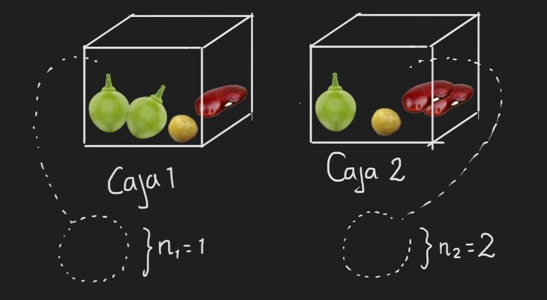

# EJERCICIOS DE DISTRIBUCIONES DE PROBABILIDAD PARA MÉTODOS ESTADÍSTICOS

## Punto 1 
1. Existen dos cajas con diferentes tipos de semillas para ser sembradas en forma aleatoria en diferentes parcelas para un experimento de campo. 



Se extrae al azar una semilla de la primera caja y dos de la segunda caja. 

En la primera caja hay dos semillas de arveja, una de frijol y una de lenteja.

En la segunda caja hay dos semillas de fríjol, una semilla de lenteja y una semilla de arveja.

Defina una variable aleatoria como el número de semillas de arveja extraídas y encuentre:

### Existen dos posibles aproximaciones a este problema. La primera:

* El numero de semillas de arveja que se pueden extraer es 0,1 y 2, para calcular las probabilidades de sacar 0,1 o 2 semillas se definen 2 eventos:

A: De la primera caja se extrae 1 semilla de arveja

B: De la segunda caja se extrae 1 semilla de arveja

$$P(A) = 2/4=0.5 $$
$$P(B) = 3/6=0.5 $$
$$ \text{La probabilidad de que se extraigan 2 semillas de arveja es } P(A\cap B) $$

```{r}
0.5*0.5
```
* La probabilidad de que se extraigan 2 semillas de arveja es de 0.25


$$ \text{La probabilidad de que se extraiga 1 semilla de arveja es } P(A\cap B)^C = P(A\cup B) - P(A\cap B)$$
```{r}
((0.5+0.5)-0.25)-0.25
```
* La probabilidad de extraer 1 semilla de arveja es de 0.5

$$ \text{La probabilidad de que se extraigan 0 semillas de arveja es } P(A\cup B)^C $$
```{r}
1-(0.5+0.5-0.25)
```
*La probabilidad de extraer 0 semillas de arveja es de 0.25

```{r echo=FALSE,message=FALSE}
x<-c(0,1,2)
fx<-c(0.25,0.5,0.25)
table<-data.frame(x,fx)
colnames(table)<-c("x","P(x)")
```


```{r}
knitr::kable(table,"simple")
```

```{r}
library(ggplot2)
barplot(height=table$`P(x)`, names=table$x, space = 5, xlab = "x", ylab = "P(x)")
plot(table$x, table$`P(x)`, type="h", xlab = "x", ylab = "P(x)")
points(table$x, table$`P(x)`, pch=16)
```

***


b. Media de la variable aleatoria
$$\mu_x =E(x)=\sum_{x=0}^2 xP(x) $$
```{r}
(0*0.25)+(1*0.5)+(2*0.25)
```
* La media o el valor esperado de la variable alatoria es 1, se espera que se saque 1 semilla de arveja

c. Desviación estándar de la variable aleatoria.
$$\sigma^2_x = V(x)= E(x^2)-E^2(x)    $$
$$E(x^2)=\sum_{x=0}^2 x^2P(x) $$
```{r}
(0*0.25)+(1*0.5)+(4*0.25)-(1*1)
((0*0.25)+(1*0.5)+(4*0.25)-(1*1))^0.5

```
* La varianza de la variable aleatoria es 0.5, y la desviacion estandar es 0.7071, la desviacion de los datos respecto a la media o el valor esperado es de 0.7071

d. Probabilidad de obtener por lo menos dos semillas de arveja.

* Para obtener la probabilidad de obtener por lo menos dos semillas de arveja, se va a sacar la funcion de probabilidad acumulada

$$ F(𝑥)=
\begin{cases} 
0 \text{ si} & 𝑥<0 \\ 
0.25 \text{ si}& 0≤𝑥<1\\ 
0.75 \text{ si}& 1≤𝑥<2\\ 
1  \text{ si} & 2≤𝑥
\end{cases} $$


$$P(2 ≤ x)= 1 - P(x≤ 1) = 1-0.75 = 0.25$$
* la probabilidad de obtener por lo menos dos semillas de arveja es de 0.25

### La segunda:

definiendo las variables:

$$
x : \text{número de semillas de arveja}
$$

$$
y : \text{número de semillas de arveja que salen de la caja 1}
$$

$$
z :\text{número de semillas de arveja que salen de la caja 2}
$$

a. Distribución de probabilidad

Dado que el experimento ocurre una sola vez, cuando se toma una muestra de semilla no se vuelve a guardar en la caja, entonces es un muestreo sin reemplazo, o una semilla no puede ser seleccionada dos veces. 

Al tener categorías, contamos con una variable discreta nominal.

La población de la cual se toman las muestras es finita, y existe un número definido de objetos que entran en cada categoría.

A su vez, en este experimento se examina un caso de éxito o fracaso, cada vez que una semilla resulta ser de cierta especie, en este caso de alverja.

Una distribución adecuada para describir esta variable sería la distribución hipergeométrica:

$$
Pr(X = k) = \frac{{K \choose k}{{N-K \choose n-k}} }{{N \choose n}}
$$
En donde:

* N es el tamaño de la población (el numero total de semillas)
* K es el numero total de alverjas
* n es la cantidad de semillas recolectadas en cada muestra
* k es el numero de semillas en la muestra que son alverjas

para y (numero de alverjas en la caja 1):

* N = 4 semillas
* K = 2 alverjas
* n = 1 semilla
* k = variable y (cuantas alverjas salen en la muestra de la caja 1)

$$
Pr(Y = k) = \frac{{2 \choose k}{{4-2 \choose 1-k}} }{{4 \choose 1}}
$$

para z (numero de alverjas en la caja 2): 

* N = 4 semillas
* K = 1 alverja
* n = 2 semillas
* k = variable z  (cuantas alverjas salen en la muestra de la caja 1)

$$
Pr(Z = k) = \frac{{1 \choose k}{{4-1 \choose 2-k}} }{{4 \choose 2}}
$$

Si X es la cantidad de alverjas total al sacar muestras de ambas cajas, se pueden obtener resultados de 0,1y 2. Entonces podemos calcular la probabilidad de cada resultado usando la función

#### Cuando al tomar muestra de las dos cajas, ninguna de ellas es una alverja. x = 0

En este caso la variable y = 0 y la variable z = 0

$$
Pr(Y = k) = \frac{{2 \choose k}{{4-2 \choose 1-k}} }{{4 \choose 1}}
$$

$$
Pr(Y = k) = \frac{{2 \choose 0}{{4-2 \choose 1-0}} }{{4 \choose 1}}
$$

$$
Pr(Y = k) = \frac{{2 \choose 0}{{2 \choose 1
}} }{{4 \choose 1}}
$$

$$
Pr(Y = k) = \frac{1 \cdot 2 }{4} = \frac{1}{2} = 0.5
$$


$$
Pr(Z = k) = \frac{{1 \choose k}{{4-1 \choose 2-k}} }{{4 \choose 2}}
$$

$$
Pr(Z = k) = \frac{{1 \choose 0}{{4-1 \choose 2-0}} }{{4 \choose 2}}
$$

$$
Pr(Z = k) = \frac{{1 \choose 0}{{3 \choose 2}} }{{4 \choose 2}}
$$

$$
Pr(Z = k) = \frac{{1 \choose 0}{{3 \choose 2}} }{{4 \choose 2}}
$$

$$
Pr(Z = k) = \frac{1 \cdot 3}{6} = \frac{1}{2} = 0.5
$$

teniendo en cuenta que son cajas diferentes, el evento de sacar una alverja en la caja 1 es independiente al de sacar una alverja en la caja 2:

$$
P(X= 0) = (Y=0 \cap Z = 0 ) = P(Z = 0) \cdot P(Y  = 0 )
$$
Entonces, la probabilidad de sacar cero alverjas al tomar una muestra de cada caja es:


$$
P(X= 0) = 0.5 \cdot 0.5 = 0.25
$$

#### Cuando al tomar muestra de las dos cajas, se obtiene una alverja

Para este caso, pueden pasar dos cosas:

1. 
        + y 


## Punto 2
2. Los siguientes datos corresponden a los resultados del parcial No1 del curso de Métodos Estadísticos: en el curso únicamente hay Biólogos, Ingenieros Químicos y Agrónomos .Las únicas notas posibles fueron 4.0, 3.0 y 2.0. El 12% son Biólogos y sacaron 4.0. El 15% son Biólogos y sacaron 3.0. El 30% de los Agrónomos sacaron 4.0 y el 20% de los Agrónomos sacaron 2.0. El 50% de los Ingenieros Químicos sacaron 4.0. El 45% de los estudiantes Ingenieros Químicos sacaron 3.0. El 30% de los estudiantes son Biólogos y el 20% son Ingenieros Químicos.
Defina una variable aleatoria X como la nota de una persona cualquiera en el curso de Métodos Estadísticos.

* Primero asignamos todas las probabilidades, para encontrar las de las notas: 
```{r echo=FALSE,message=FALSE}
Biologia<-c(0.03,0.15,0.12,0.3)
Ing.Quimica<-c(0.01,0.09,0.1,0.2)
Agronomia<-c(0.1,0.25,0.15,0.5)
Px<-c(0.14,0.49,0.37,1)
table1<-data.frame(Biologia,Ing.Quimica,Agronomia,Px)
rownames(table1)<-c("2.0","3.0","4.0"," ")
```


```{r}
knitr::kable(table1,"simple")
```

```{r echo=FALSE,message=FALSE}
x1<-c(2,3,4)
fx1<-c(0.14,0.49,0.37)
table2<-data.frame(x1,fx1)
colnames(table2)<-c("x","P(x)")
```

teniendo las probabilidades de notas 2, 3 y 4 se obtiene la distribucion de probabilidad:
```{r}
knitr::kable(table2,"simple")
```

```{r}
plot(table2$x, table2$`P(x)`, type="h", xlab = "x", ylab = "P(x)")
points(table2$x, table2$`P(x)`, pch=16)
```
a. Calcule el valor esperado

$$E(x)=\sum_{x=2}^4 xP(x) $$
```{r}
(2*0.14)+(3*0.49)+(4*0.37)
```
* El valor esperado es 3.23, se espera que los estudiantes tengan una nota de 3.23 en el curso

b. Calcule la varianza y desviación estándar de la variable aleatoria X.

$$\sigma^2_x = V(x)= E(x^2)-E^2(x)    $$
$$E(x^2)=\sum_{x=2}^4 x^2P(x) $$
```{r}
(4*0.1)+(9*0.49)+(16*0.37)-(3.23*3.23)
((4*0.14)+(9*0.49)+(16*0.37)-(3.23*3.23))^0.5
```
4
* La varianza de la variable aleatoria es 0.4571, y la desviacion estandar es 0.6761, la desviacion de los datos respecto a la media o el valor esperado es de 0.6761


c. Si el profesor decide regalarle a todos los estudiantes del curso 0.5 sobre la nota del parcial. Calcule el valor esperado, la varianza y la desviación estándar de la variable aleatoria X.

* Con los nuevos datos se saca la distribucion de probabilidad

```{r echo=FALSE,message=FALSE}
x2<-c(2.5,3.5,4.5)
fx2<-c(0.14,0.49,0.37)
table3<-data.frame(x2,fx2)
colnames(table3)<-c("x","P(x)")
```

```{r}
knitr::kable(table3,"simple")
```

$$E(x)=\sum_{x=2.5}^{4.5}  xP(x) $$
```{r}
(2.5*0.14)+(3.5*0.49)+(4.5*0.37)
```
* El valor esperado es 3.73, se espera que los estudiantes tengan una nota de 3.73 en el curso

$$\sigma^2_x = V(x)= E(x^2)-E^2(x)    $$

```{r }
(6.25*0.14)+(12.25*0.49)+(20.25*0.37)-(3.73*3.73)
((6.25*0.14)+(12.25*0.49)+(20.25*0.37)-(3.73*3.73))^0.5
```

* La varianza de la variable aleatoria es 0.4571, y la desviacion estandar es 0.6761, la desviacion de los datos respecto a la media o el valor esperado es de 0.6761


## Punto 3
3. En un curso de la universidad hay 40 estudiantes, de los cuales 20 estudian Fitopatología, 15 estudian Entomología y 5 estudian Suelos.
El profesor decidió regalar cinco décimas de la nota del parcial a cuatro estudiantes diferentes.

Dado que se seleccionan solo cuatro estudiantes diferentes, los nombres no pueden repetirse, por lo tanto se hace un muestreo sin reemplazo.

Al ser estudiantes de 3 distintas carreras, se trabaja con una variable discreta nominal.

La población, el número total de estudiantes es finito, y existe un número definido de estudiantes que entran en cada categoría.

Cuando se selecciona a un estudiante, puede haber éxito o fracaso en que sea de una carrera u otra.

Una distribución adecuada para describir esta variable puede ser la distribución hipergeométrica.

$$
Pr(X = k) = \frac{{K \choose k}{{N-K \choose n-k}} }{{N \choose n}}
$$

a. Cuál es la probabilidad de que los elegidos sean todos de Fitopatología?

para este caso podemos definir $x$ como el número de estudiantes de fitopatologia escogidos 

* N = 40 estudiantes
* K = 20 estudiantes de fitopatologia
* n = 4 estudiantes seleccionados
* k = 4 estudiantes de la muestra que son de fitopatología

$$
Pr(X = 4) = \frac{{20 \choose 4}{{40-20 \choose 4-4}} }{{40 \choose 4}}
$$

$$
Pr(X = 4) = \frac{{20 \choose 4}{{40-20 \choose 4-4}} }{{40 \choose 4}}
$$
```{r}
(choose(20,4)*choose(20,0))/choose(40,4)
```
 

b. Cuál es la probabilidad de que entre los elegidos haya al menos un estudiante de suelos?
X = numero de estudiantes de suelos que fueron seleccionados en la muestra


Gracias a las propiedades de las funciones de probabilidad:

$$
Pr(X \geq 1) =  1 - Pr(X \leq 1 - 1) = 1 - Pr(X \leq 0)
$$

* N = 40 estudiantes
* K = 5 estudiantes de suelos
* n = 4 estudiantes seleccionados
* k = 0 estudiantes de la muestra que son de suelos (por propiedades de funciones de probabilidad)

$$
Pr(X = k) = \frac{{5 \choose 0}{{40-5 \choose 4-0}} }{{40 \choose 4}}
$$

```{r}
P0 <- (choose(5,0)*choose(35,4))/choose(40,4)
1-P0
```
La probabilidad de que entre los elegidos haya al menos un estudiante de suelos es de 0.43

c. Cuál es la probabilidad de que hayan dos estudiantes de Fitopatología, uno de suelos y uno de entomología?


Dado que las tres variables son independientes, podemos calcular su intersección como el producto de las tres probabilidades.

$$
P(X = 2) \cdot P(Y = 1) \cdot P(Z = 1) =
$$

$$
\frac{{20 \choose 2}{{40-20 \choose 4-2}} }{{40 \choose 4}} \cdot  \frac{{5 \choose 1}{{40-20 \choose 4-1}} }{{40 \choose 4}} \cdot  \frac{{15 \choose 1}{{40-20 \choose 4-1}} }{{40 \choose 4}}
$$


$$
P(X = 2) \cdot P(Y = 1) \cdot P(Z = 1) =
$$

$$
\frac{{20 \choose 2}{{20 \choose 2}} }{{40 \choose 4}} \cdot  \frac{{5 \choose 1}{{35 \choose 3}} }{{40 \choose 4}} \cdot  \frac{{15 \choose 1}{{25 \choose 3}} }{{40 \choose 4}}
$$

```{r}
((choose(20,2)*choose(20,2))/choose(40,4)) *((choose(5,1)*choose(35,3))/choose(40,4))* ((choose(15,1)*choose(25,3))/choose(40,4))
```
La probabilidad de que sean 2 estudiantes de fitopatologia, 1 de suelos y 1 de entomologia.

## Punto 4
4. Un lote consta de 10 artículos sin defecto, 4 con pequeños defectos y 2 con defectos graves. Si se elige un artículo al azar, encuentre la probabilidad de que:


a. No tenga defectos

$$
X = \text{el numero de articulos seleccionado que no tienen defectos}
$$

$$
Pr(X = k) = \frac{{K \choose k}{{N-K \choose n-k}} }{{N \choose n}}
$$
* N = 16 articulos
* K = 10 articulos sin defecto
* n = 1 articulo seleccionado 
* k = 1 articulo seleccionado sin defectos

$$
Pr(X = k) = \frac{{10 \choose 1}{{16 -10 \choose 1-1}} }{{16 \choose 1}}
$$
$$
Pr(X = k) = \frac{{10 \choose 1}{{6 \choose 0}} }{{16 \choose 1}}
$$
```{r}
(choose(10,1)*choose(6,0))/(choose(16,1))
```
La probabilidad de que un articulo que se escogio al azar no tenga defectos es de  0.625


b. No tenga defecto o tenga un defecto grave.

Podemos calcular la probabilidad de cda uno de los eventos:

1. que no tenga defectos = 0.625

2. que tenga un defecto grave:

* N = 16 articulos
* K = 2 articulos sin defecto
* n = 1 articulo seleccionado 
* k = 1 articulo seleccionado sin defectos

$$
Pr(X = k) = \frac{{2 \choose 1}{{16 -2 \choose 1-1}} }{{16 \choose 1}}
$$
```{r}
(choose(2,1)*choose(16-2,0))/(choose(16,1))
```
calculamos la probabilidad de que ocurra un evento O el otro como la unión, sumando las probabilidades:

```{r}
0.625 + 0.125
```
La probabilidad de que el articulo seleccionado no tenga defectos o tenga un defecto grave es de 0.75

Si se eligen dos artículos al azar, encontrar la probabilidad de que:

c. Al menos uno sea bueno.

Podemos usar las propiedades de las funciones de probabilidad:

$$
P(X \geq 1) = 1 - P(X \leq 1 -1) 1 - P(X \leq 0)
$$
* N = 16 articulos
* K = 10 articulos sin defecto
* n = 2 articulo seleccionados
* k = 0 articulo seleccionado sin defectos

$$
Pr(X = k) = \frac{{10 \choose 0}{{6 \choose 2}} }{{16 \choose 2}}
$$
```{r}
(choose(10,0)*choose(16-10,2))/(choose(16,2))
```
La probabilidad de que al seleccionar dos articulos al azar al menos uno sea bueno (sin defectos) es de 0.125
d. Exactamente uno sea bueno.

e. Ambos tengan defectos graves.


* N = 16 articulos
* K = 2 articulos con defectos graves
* n = 2 articulo seleccionados
* k = 2 articulo seleccionado sin defectos

$$
Pr(X = k) = \frac{{2 \choose 2}{{16-2 \choose 2-2}} }{{16 \choose 2}}
$$

```{r }
(choose(2,2)*choose(16-2,2-2))/(choose(16,2))
```
La probabilidad de que al seleccionar 2 articulos al azar ambos tengan defectos graves es de 0.0083

## Punto 5
5. Cinco pelotas enumeradas 1,2,3,4,y 5 se encuentran en una urna. Se sacan dos pelotas al azar de las cinco sin reemplazo y se anotan sus números. Encuentre la distribución de probabilidad para:

a. El mayor de los números seleccionados.
```{r echo=FALSE,message=FALSE}
x4<-seq(2,5)
fx4<-seq(1,4)
table5<-data.frame(x4,fx4)
colnames(table5)<-c("x","P(x)")
```

* La distribucion de probabilidad del mayor de los numeros seleccionados:
```{r}
knitr::kable(table5,"simple")
```

```{r}
plot(table5$x, table5$`P(x)`, type="h", xlab = "x", ylab = "P(x)")
points(table5$x, table5$`P(x)`, pch=16)
```


b. La suma de los números seleccionados.

```{r echo=FALSE,message=FALSE}
x3<-seq(3,9)
fx3<-rep(c(0.1,0.2,0.1), times= c(2,3,2))
table4<-data.frame(x3,fx3)
colnames(table4)<-c("x","P(x)")
```

* La distribucion de probabilidad de la suma de los numeros seleccionados:
```{r}
knitr::kable(table4,"simple")
```

```{r}
plot(table4$x, table4$`P(x)`, type="h", xlab = "x", ylab = "P(x)")
points(table4$x, table4$`P(x)`, pch=16)
```


## Punto 6
6. En una investigación realizada entre estudiantes de Biología aspirantes al grado de maestría, 75 por ciento declararon que esperaban ser promovidos a un puesto más alto un mes después de obtener el grado. Si este porcentaje representa a toda la población, encontrar para una muestra de 15, la probabilidad de que el número de personas que esperan una promoción un mes después de obtener el grado sean:

* Sigue una distribucion binomial con p = 0.75 y n = 15:
X: Numero de personas que esperan una promocion 

$$
P(𝑥)=
\begin{cases} 
\binom{15}{x} (0.75)^x (0.25)^{15-x}  \text{     si }  x = 0,1,2,3,...,15 \\ 
0  \text{ en otro caso} 
\end{cases} 
$$ 

a. Seis
$$
P(X = 6) 
$$
```{r }
dbinom(6, 15, 0.75)
```
* La probabilidad de que 6 personas esperan una promoción un mes después de obtener el grado  es 0.0034

b. Al menos siete
$$
P(X ≥ 7) = 1- P(X≤6) 
$$
```{r }
1-pbinom(6, 15, 0.75)
```

* La probabilidad de que al menos 7 personas esperan una promoción un mes después de obtener el grado  es 0.996

c. No más de cinco
$$
P(X≤5) 
$$
```{r }
pbinom(5, 15, 0.75)
```

* La probabilidad de que no más de 5 personas esperan una promoción un mes después de obtener el grado  es 0.00079


d. Entre seis y nueve

$$ 
P(6≤X≤9) = P(X≤9)-P(X≤5) 
$$
```{r }
pbinom(9, 15, 0.75)-pbinom(5, 15, 0.75)
```

* La probabilidad de que entre 6 y 9 personas esperan una promoción un mes después de obtener el grado  es 0.147


## Punto 7
7. En un estudio sobre la efectividad de un insecticida contra cierto insecto, se fumigo una gran área de tierra, que más tarde se examinó por cuadrantes elegidos aleatoriamente y en la que se contó el número de insectos vivos por sección. Experiencias previas han demostrado que el número promedio de insectos vivos por cuadrante, después de fumigar, es de 0.5. Cuál es la probabilidad de que cierto cuadrante elegido tenga:

* En este caso sigue la distribucion de Poisson con 𝜆= 0.5:

$$
P(𝑥)=
\begin{cases} 
\frac {e^{-0.5} 0.5^x} {x!}  \text{     si }  x = 0,1,2,3,... \\ 
0  \text{ en otro caso} 
\end{cases} 
$$

a. Exactamente un insecto vivo
$$
P(X=1)   
$$
```{r }
dpois(1, lambda= 0.5 )
```

* La probabilidad de que cierto cuadrante elegido tenga exactamente un insecto vivo es  0.303

b. Cero insectos vivos
$$
P(X=0)   
$$
```{r }
dpois(0, lambda= 0.5 )
```

* La probabilidad de que cierto cuadrante elegido tenga 0 insectos vivos es 0.606

c. Exactamente cuatro insectos vivos

$$
P(X=4)  
$$
```{r }
dpois(4, lambda= 0.5 )
```

* La probabilidad de que cierto cuadrante elegido tenga exactamente cuatro insectos vivos es 0.0016

d. Al menos un insecto vivo

$$
P(X≥ 1) = 1- P(X≤ 0) 
$$
```{r }
1-ppois(0, lambda=10 )
```

* La probabilidad de que cierto cuadrante elegido tenga al menos un insecto vivo es 0.999


## Punto 8
8. Muchas compañías de energía eléctrica han empezado a promover el ahorro de energía al favorecer descuentos a consumidores que mantienen el consumo de energía por debajo de ciertas normas de subsidio establecidas. Un reciente reporte informa que el 70% de los habitantes de cierta área han reducido suficientemente el uso de energía para poder disfrutar de los descuentos. Si se selecciona al azar cinco residentes del área en mención, encuentre la probabilidad de que:

* Sigue una distribucion binomial con p = 0.7 y n = 5:
X: Numero de personas que califican para tarifas mas favorables

$$ 
P(𝑥)=
\begin{cases} 
\binom{5}{x} (0.7)^x (0.3)^{5-x}  \text{     si }  x = 0,1,2,...,5 \\ 
0  \text{ en otro caso} 
\end{cases} 
$$ 

a. Los cinco califiquen para tarifas más favorables.
$$
P(X = 5) 
$$
```{r }
dbinom(5, 5, 0.7)
```

* La probabilidad de que los cinco califiquen para tarifas más favorables es de 0.168

b. Al menos cuatro califiquen para tarifas más favorables.

$$
P(X ≥ 4) = 1- P(X≤3) 
$$
```{r }
1-pbinom(3, 5, 0.7)
```

* La probabilidad de que al menos cuatro califiquen para tarifas más favorables es de 0.528

c. Al menos 2, pero no más de 4 califiquen para tarifas más favorables.
$$
P(2≤X≤4) = P(X≤4) - P(X≤1)
$$
```{r }
pbinom(4, 5, 0.7) - pbinom(1, 5, 0.7)
```

* La probabilidad de que al menos 2, pero no más de 4 califiquen para tarifas más favorables es de 0.801

d. A lo más 4 califiquen para tarifas más favorables.
$$
P(X≤4)  
$$
```{r }
pbinom(4, 5, 0.7)
```

* La probabilidad de que a lo más 4 califiquen para tarifas más favorables 0.832


## Punto 9
9. Un examen de respuestas múltiples contiene 15 preguntas y cada pregunta cinco respuestas posibles; el examen se aprueba contestando por lo menos el 60% de las preguntas correctamente. Si un estudiante no se preparó para el examen. Cuál es la probabilidad de que dicho estudiante pierda el examen?

* Sigue una distribucion binomial con p = 0.2 y n = 15:
X: Numero de aciertos que tendra el estudiante al contestar el examen al azar

$$ 
P(𝑥)=
\begin{cases} 
\binom{15}{x} (0.2)^x (0.8)^{15-x}  \text{     si }  x = 0,1,2,3,...,15 \\ 
0  \text{ en otro caso} 
\end{cases} 
$$ 

Para pasar el examen debe acertar en 9 preguntas, entonces la probabilidad de que lo pierda es 0.999

$$
P(X< 9)= P(X≤8) 
$$
```{r }
pbinom(8, 15, 0.2)
```

## Punto 10
10. En promedio, cinco fumadores pasan por la esquina de cierta calle cada 10 minutos. Cuál es la probabilidad de que durante un periodo dado de 20 minutos el número de fumadores que pasen sea de:

* En este caso sigue la distribucion de Poisson con 𝜆= 10:

$$
P(𝑥)=
\begin{cases} 
\frac {e^{-10} 10^x} {x!}  \text{     si }  x = 0,1,2,3,... \\ 
0  \text{ en otro caso} 
\end{cases} 
$$

a. Seis o menos.

$$
P(X≤ 6)   
$$
```{r }
ppois(6, lambda=10 )
```

* La probabilidad de que durante 20 minutos seis o menos fumadores pasen es de 0.130

b. Siete o más
$$
P(X≥ 7) = 1- P(X≤ 6) 
$$
```{r }
1-ppois(6, lambda=10 )
```

* La probabilidad de que durante 20 minutos siete o más fumadores pasen es de 0.869

c. Exactamente ocho.
$$
P(X=8)   
$$
```{r }
dpois(8, lambda=10 )
```

* La probabilidad de que durante 20 minutos exactamente ocho fumadores pasen es de 0.1126


d. Entre seis y siete.

$$
P(6≤X≤ 7) =  P(X≤ 7)- P(X≤ 5) 
$$
```{r }
ppois(7, lambda=10 )-ppois(5, lambda=10 )
```

* La probabilidad de que durante 20 minutos entre seis y siete fumadores pasen es de 0.153

## Punto 11
11. Una concentración particular de una sustancia química, encontrada en agua contaminada resulto ser mortal para el 20% de los peces expuestos a esta concentración durante 24 horas. Se colocan 20 peces en un tanque que contiene agua con esta concentración del producto químico.

* Sigue una distribucion binomial con p = 0.8 y n = 20:
X: Numero de peces que sobreviven en el tanque con el agua contaminada

$$
P(𝑥)=
\begin{cases} 
\binom{20}{x} (0.8)^x (0.2)^{20-x}  \text{     si }  x = 0,1,2,3,...,20 \\ 
0  \text{ en otro caso} 
\end{cases} 
$$ 

a. Determine la probabilidad de que exactamente 14 sobrevivan.

$$ 
P(X = 14) 
$$
```{r }
dbinom(14, 20, 0.8)
```
* La probabilidad de que exactamente 14 sobrevivan es de 0.109

b. Determine la probabilidad de que por lo menos el 50% de los peces sobrevivan.
$$ 
P(X ≥ 10) = 1- P(X≤9) 
$$
```{r }
1-pbinom(9, 20, 0.8)
```

* La probabilidad de que por lo menos el 50% de los peces sobrevivan es de 0.999

c. Obtenga la probabilidad de que a lo más 16 sobrevivan.
$$
P(X≤16)  
$$
```{r }
pbinom(16, 20, 0.8)
```

* La probabilidad de que a lo más 16 sobrevivan es de 0.588

d. Obtenga la media y la varianza del número de peces que sobreviven.
$$
E(x)= n*p 
$$
```{r}
20*0.8
```
* El valor esperado es 16, se espera que 16 peces sobrevivan 

$$
\sigma^2_x = V(x)= n*p*(1-p)    
$$

```{r }
20*0.8*0.2
```

* La varianza es de 3.2


## Punto 12

12. Un profesor conoce que la nota final de sus estudiantes sigue una distribución aproximadamente normal y además sabe que en general el 2.28% de sus estudiantes sacan menos de uno y que el 15.87% sacan más de cuatro. Cuál es el promedio y la desviación estándar de la nota final de los estudiantes del profesor en mención.

* Es necesario estandarizar:

```{r }
qnorm(c(0.0228), mean = 0, sd = 1, lower.tail = T)
qnorm(c(0.1587), mean = 0, sd = 1, lower.tail = F)
3/(-qnorm(c(0.0228), mean = 0, sd = 1, lower.tail = T)+ qnorm(c(0.1587), mean = 0, sd = 1, lower.tail = F))

3/(-qnorm(c(0.0228), mean = 0, sd = 1, lower.tail = T)+ qnorm(c(0.1587), mean = 0, sd = 1, lower.tail = F))+1+qnorm(c(0.1587), mean = 0, sd = 1, lower.tail = F)
```


$$ 
P( z ≤ \frac {1 - \mu} {\sigma})=0.0228
$$
$$
P( z ≤ z_0) = 0.0228 
$$
$$
 z_0 = -1.99 
$$
$$
-1.99 =\frac {1- \mu} {\sigma}
$$
$$
\mu=1+1.99 \sigma
$$


$$ 
P( z ≥ \frac {4- \mu} {\sigma})=0.1587 
$$
$$
P( z ≥ z_0) = 0.1587
$$
$$
z_0 = 0.9998
$$
$$
0.9998 =\frac {4- \mu} {\sigma}
$$
$$
0.9998 =\frac {4- 1+1.99\sigma} {\sigma}
$$
$$
\sigma = \frac {3} {1.99+0.9998} = 1.00
$$


$$
\mu=1+1.99 \sigma\\
\mu=1+1.99 (1.00) = 3.00 
$$


* El promedio es de 3 y la desviación estándar es de 1 de la nota final de los estudiantes del profesor 

## Punto 13
13. La vida promedio de cierto tipo de motor pequeño tiene una distribución normal con promedio de 10 años y desviación estándar de dos años. El fabricante reemplaza gratis todos los motores que fallen dentro del tiempo de garantía. Si está dispuesto a reemplazar solo el 3% de los motores que fallan. Qué tan larga debe ser la garantía que otorgue?


```{r }
qnorm(c(0.03), mean = 10, sd = 2, lower.tail = T)
```
* La garantia debe ser de 6.23 años

## Punto 14
14 Una compañía constructora paga a sus trabajadores un salario promedio de 15.80 dólares/hora con una desviación estándar de 1.50 dólares/hora. Si los salarios se distribuyen aproximadamente normal.

a. Qué proporción de los trabajadores recibe salario entre  13.75 y  16.22 dólares/hora?
```{r }
pnorm(16.22, mean = 15.8, sd = 1.5, lower.tail = T, log.p = FALSE)-pnorm(13.75, mean = 15.8, sd = 1.5, lower.tail = T, log.p = FALSE)
```

* 0.524 de los trabajadores recibe salario entre  13.75 y  16.22 dólares/hora

b. El 10% de los salarios más bajos no superan a qué cantidad?
```{r }
qnorm(c(0.1), mean = 15.8, sd = 1.5, lower.tail = T)
```

* El 10% de los salarios más bajos no superan a 13.8 dólares/hora

c. El 5 % de los empleados mejor remunerados ganan mínimo qué cantidad?
```{r }
qnorm(c(0.05), mean = 15.8, sd = 1.5, lower.tail = F)
```
* El 5 % de los empleados mejor remunerados ganan mínimo 13.33 dólares/hora


## Punto 15
15 Se regula una máquina despachadora de refresco para que sirva en promedio 200 mililitros por vaso. Si la cantidad de bebida se distribuye normalmente con una desviación estándar igual a 15 mililitros,

a. Qué fracción de los vasos contendrán más de 224 mililitros?
```{r }
pnorm(224, mean = 200, sd = 15, lower.tail = F, log.p = FALSE)
```

* 0.945 de los vasos contendrán más de 224 mililitros

b. Cuál es la probabilidad de que un vaso contenga entre 191 y 209 mililitros?
```{r }
pnorm(209, mean = 200, sd = 15, lower.tail = T, log.p = FALSE)-pnorm(191, mean = 200, sd = 15, lower.tail = T, log.p = FALSE)
```

* La probabilidad de que un vaso contenga entre 191 y 209 mililitros es de 0.451

c. Cuántos vasos probablemente se derramarán si se utilizan vasos de 230 mililitros para las siguientes 1000 bebidas?
```{r }
pnorm(230, mean = 200, sd = 15, lower.tail = F, log.p = FALSE)
pnorm(230, mean = 200, sd = 15, lower.tail = F, log.p = FALSE)*1000
```

* 977 vasos probablemente se derramarán si se utilizan vasos de 230 mililitros para las siguientes 1000 bebidas

d. Por debajo de qué valor obtendremos 25% de las bebidas más pequeñas?
```{r }
qnorm(c(0.25), mean = 200, sd = 15, lower.tail = T)
```

* Por debajo de 189.88 obtendremos 25% de las bebidas más pequeñas


## Punto 16
16. Suponga que una variable aleatoria X se distribuye normalmente con una desviación estándar de 10. Dado que 0.0985 de los valores de X son mayores que 70. Cuál es el valor de la media de X?

* Es necesario estandarizar:

```{r }
qnorm(c(0.0985), mean = 0, sd = 1, lower.tail = T)
70-(-(qnorm(c(0.0985), mean = 0, sd = 1, lower.tail = F)*10))

```

$$ 
P( z ≥ \frac {70- \mu} {10})=0.0985
$$
$$
P( z ≥ z_0) = 0.0985
$$
$$ 
z_0 = 1.29 
$$
$$
1.29 =\frac {70- \mu} {10}
$$
$$
\mu=70-12.9 =57.098
$$


la media de X es 57.098


## Punto 17
17. Construya los gráficos de la función de masa de probabilidad y función de distribución acumulada para una variable aleatoria con distribución Binomial de parámetros n=20 y p=0.6. Qué puede decir de las distribuciones obtenidas? Concluya.

```{r }
xh0 <- rbinom(100,size=20, prob=0.6)
yv0 <- dbinom(xh0,size=20, prob=0.6)
plot(xh0, 
     yv0, 
     type="h", 
     xlab = "x", 
     ylab = "f(x)", 
     main = "Funcion de masa de Probabilidad Binomial",
     xlim = c(0,24))
points(xh0, yv0, pch=16)
hh0<-pbinom(xh0,size=20, prob=0.6)
plot(xh0, hh0, type="h", xlab = "x", ylab = "F(x)", main = "Funcion de distribucion acumulada Binomial")
points(xh0, hh0, pch=16)
```

* Tanto la funcion de masa de probabilidad, como la funcion de distribucion acumulada para una variable aleatoria con distribucion Binomial se pueden aproximar a una distribucion normal, presentando una forma de campana alrededor de 12 para la funcion de masa de probabilidad y una forma de s para la función de probabilidad acumulada.

## Punto 18
18. Construya los gráficos de la función de masa de probabilidad y función de distribución acumulada para una variable aleatoria con distribución Poisson de parámetro 𝜆=4.5 .Qué puede decir de las distribuciones obtenidas? Concluya.

```{r }
xh <- rpois(100, lambda = 4.5)
yv<-dpois(xh, lambda = 4.5, log = F)
plot(xh, yv, type="h", xlab = "x", ylab = "f(x)", main = "Funcion de masa de Probabilidad Poisson")
points(xh, yv, pch=16)
hh<-ppois(xh,lambda = 4.5, log.p = F, lower.tail = T)
plot(xh, hh, type="h", xlab = "x", ylab = "F(x)", main = "Funcion de distribucion acumulada Poisson")
points(xh, hh, pch=16)
```

* Tanto la funcion de masa de probabilidad, como la funcion de distribucion acumulada para una variable aleatoria con distribucion Poisson se pueden aproximar a una distribucion normal, las formas son muy similares.


## Punto 19

19. Sea 𝑓 la función dada por:
$$ 
𝑓(𝑥)=
\begin{cases} 
𝛼𝑥^2(1−𝑥)  \text{     si }  0≤𝑥≤1 \\ 
0  \text{ en otro caso} 
\end{cases} 
$$
a. Determine el valor de 𝛼, para que 𝑓 sea función de densidad de probabilidad de una variable aleatoria continua 𝑋.

* Para que f sea funcion de densidad de probabilidad:

$$
\int_0^1 \alpha x^2(1-x) dx =1 
$$
$$
\alpha\int_0^1  x^2-x^3 dx =1 
$$
$$
\alpha  \left(\int_0^1  x^2 dx-\int_0^1x^3 dx \right) =1
$$
$$ 
\left[\left. \frac {x^3} {3} \right|_{0}^{1} = \frac {1} {3}\right] - \left[ \left. \frac {x^4} {4} \right|_{0}^{1} = \frac {1} {4}\right] 
$$
$$
 \alpha = \frac {1} {\frac {1} {3}-\frac {1} {4}}
$$
 

 
 
 
* Para que sea funcion de probabilidad 𝛼 es 12

b. Halle la función de distribución acumulada 𝐹(𝑥).

$$
F(x)= \int_0^x 12 (t^2-t^3) dt  
$$
$$
F(x)= 12  \left(\int_0^x  t^2 dt-\int_0^x t^3 dt \right)  
$$
$$
 F(x)= \left[12\left. \frac {t^3} {3} \right|_{0}^{x} = 4x^3\right] - \left[12\left. \frac {t^4} {4} 
$$ 
$$
 F(x)= 4x^3-3x^4
$$
 
$$ 
F(x)=
\begin{cases} 
0 \text{ si} & 𝑥<0 \\ 
4x^3-3x^4 \text{ si}& 0≤x<1\\ 
1  \text{ si} & 1≤x
\end{cases} 
$$ 


c. Calcule la 𝑝(𝑋≥1/2)

$$ 
P(𝑋≥0.5)
$$
$$
=  \int_{0.5}^{1} 12x^2-12x^3
$$
$$
=\left[12\left. \frac {x^3} {3} \right|_{0.5}^{1} = 4-4(0.5)^3 \right] - \left[12\left. \frac {x^4} {4} \right|_{0.5}^{1} = 3-3(0.5)^4 \right]
$$
$$
= 3.5 - 2.8125 = 0.6875
$$

d. Calcule 𝑝(−3≤𝑋<1)
$$ 
P(-3≤𝑋<1 )
$$
$$
= \int_{-\infty}^0 0 dx + \int_0^1 12x^2-12x^3
$$
$$
=\left[12\left. \frac {x^3} {3} \right|_{0}^{1} = 4\right] - \left[12\left. \frac {x^4} {4} \right|_{0}^{1} = 3 \right] 
$$
$$
= 4-3 = 1
$$


## Punto 20

20. La función de distribución acumulada de una variable aleatoria 𝑋 está dada por:
$$ 
F(𝑥)=
\begin{cases} 
0 \text{ si} & 𝑥<0 \\ 
2𝑥−𝑥^2 \text{ si}& 0≤𝑥≤1\\ 
1  \text{ si} &𝑥>1
\end{cases} 
$$

a. Graficar 𝐹(𝑥)
```{r }
curve( 2*x- x^2, from=0, to=1, n=300, xlab="x", ylab="F(x)", xlim = c(-0.8,1.8),
             col="blue", lwd=2, main="Funcion de probabilidad acumulada", ylim =c(0,1)  )
lines(c(-1,0),c(0,0), col="blue", lwd=2)
lines(c(1,2),c(1,1), col="blue", lwd=2)
```

b. Determinar 𝑓(𝑥)
$$
\frac {d} {dx} (2x-x^2)=
$$
$$
\frac {d} {dx}(2x)- \frac {d} {dx}(x^2)= 2-2x
$$
$$
f(x)= 2-2x
$$


c. Obtener 𝑝(𝑥≥3/2)

$$ 
P(x ≥3/2 ) 
$$
$$
= \int_{1.5}^{\infty} 1 dx
$$

$$
=1 
$$


